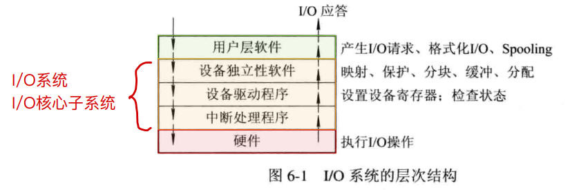
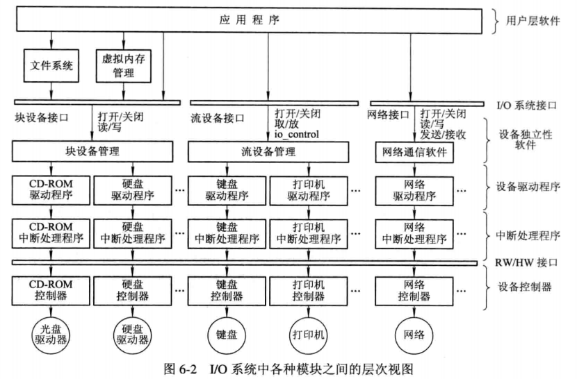
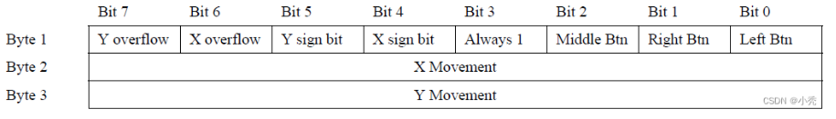
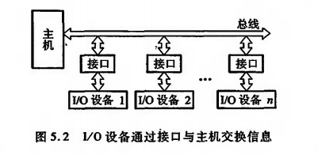

## URL的伟大冒险
再烧一把火吧，为荒诞的人生添一点壮烈的红。

### 路线详情

鼠标IO事件 -- 处理机中断处理 -- 设备驱动器解析 -- 识别快捷方式 -- 文件系统读取 -- 指令编译 -- 进程初始化 -- 内存调度 -- 用户界面更新 -- URL输入 -- DNS -- HTTP -- TCP -- IP -- 以太网传输 -- 编码调制 -- 路由选择 -- 服务器响应

### 参考教材

`co--唐朔飞 / os--汤小丹 / net--谢希仁`

### 鼠标IO事件

`co-unit5和os-unit6的io部分`

io系统的层次结构如下：

鼠标生成电信号，通过计算机的接口（例如USB或PS/2接口）被传输到南桥芯片，通过特定的接口（如中断控制器）与CPU进行通信。CPU会响应这个通信请求，并暂时中断当前的任务，转而处理鼠标输入。用相应的设备驱动程序来处理鼠标输入。设备驱动程序将电信号转换为操作系统可以理解的数据结构。后使用设备独立性软件来进一步处理这些信号，操作系统将信号转换为系统事件后，通过用户层IO软件传递给应用程序。用户层IO软件提供了一组API（应用程序接口），应用程序通过调用这些API与硬件设备进行交互，后根据事件类型进行相应的处理，将结果显示在显示器上。

io设备与主机的连接，主要分为`通过接口模块和主机的链接`和使用`通道`的链接。

1. 使用接口模块和DMA连接

   

2. 使用通道连接

### 处理机中断处理

`co-unit3-unit8和os-unit3-unit6的总线，处理机部分`

### 设备驱动器解析

`os-unit6的io部分`

### 识别快捷方式

`co-unit7-unit9-unit10的io，指令系统，控制单元部分`

### 文件系统读取

`os-unit7的文件管理部分`

### 进程初始化

`os-unit2的进程控制部分`

### 内存调度

`co-unit4和os-unit4-unit5的存储器部分`

### DNS,HTTP

`net-unit5-unit6的传输层，应用层部分`

### TCP

`net-unit5的传输层部分`

### IP

`net-unit4的网络层部分`

### 以太网传输

`net-unit3的数据链路层部分`

### 编码调制

`net-unit2的物理层部分`

### 路由选择

`net-unit4的网络层部分`
