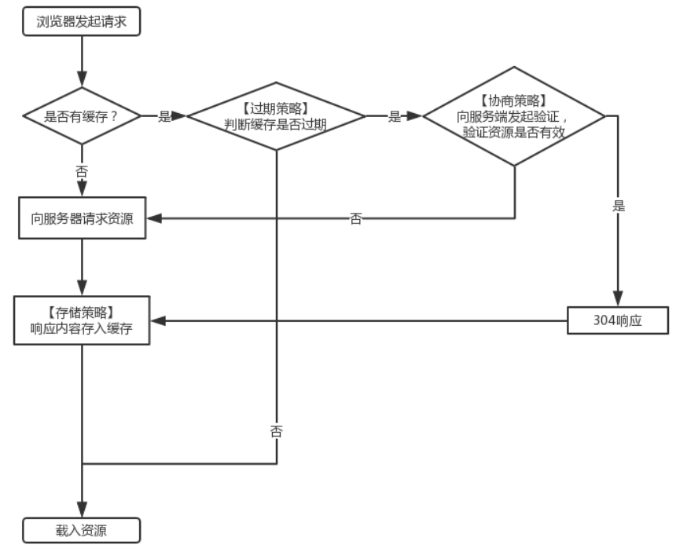

## 浏览器的组成

了解浏览器的运行，首先要先了解浏览器的组成。浏览器由`shell`(命令解析代理，简单来说就是`代理用户对内核的操作`)和浏览器`内核`组成。

shell 组成：

- 用户界面：除浏览器请求的页面以外，都属于用户界面。
- 网络：用于网络请求，包含多种文件传输协议，如HTTP、FTP等。
- UI后端：用于绘制''对话框''等基本组件。
- JS解释器：解释并执行网页中的javascript代码
- XML解析器：将XML文档解析成文档对象模型(DOM)
- 数据存储：将浏览器数据存储在硬盘上

内核组成：
- 浏览器引擎：为渲染引擎提供高级接口

- 渲染引擎：负责显示请求的内容。负责解析请求到的HTML、CSS 并将其显示

## 浏览器的进程

除了浏览器的组成，在谈到一段程序在计算机中的运行时，那必须提到`进程`和`线程`的概念

- **进程(资源分配的最小单位)**：**一个`执行中程序`的实例**

早期`单道批操作系统`的计算机，仅执行一个程序，由其分配所有的系统资源，利用率非常低。后改进为`多道批操作系统`，可以在内存中同时加载多道程序并发执行，在某个程序需要等待资源时，CPU会去执行其他程序，但因为各个程序共享资源，导致经常出现资源冲突问题。因此提出了`进程`的概念，只有进程可以申请系统资源，进程间不会共享资源。系统通过PCB(*process control block*)对进程进行管理和调度。

- **线程(CPU调度的最小单位)**：线程是进程中的一个实体

因为进程的创建、销毁与切换存在着较大的时空开销，因此提出了`线程`来减少开销。同一进程间的线程共享进程的资源。因为线程是进程的的组成部分，所以线程的管理(*通过线程控制块TCB*)可以有两种选择，一种是让进程自己管理线程(**用户态线程**)，另一种是通过操作系统管理线程(**内核态线程**)，但用于两种选择都有缺陷，现代操作系统选择将二者结合起来，`用户态的执行系统负责进程内部线程在非阻塞时的切换；内核态的操作系统负责阻塞线程的切换，即同时实现内核态和用户态线程管理。`当线程未阻塞时，由用户态对线程进行切换，当线程发生中断或异常时，切换到内核态执行中断处理。

浏览器常见的进程有以下几种：


- Browser进程：浏览器的主进程，负责协调控制浏览器
- GPU进程：用于3D绘制等
- Network进程：负责发起接受网络请求
- Storage进程：从原来的主进程中分离出来的缓存服务，主要负责提供浏览器本地存储等功能
- 渲染进程：负责控制显示tab标签页的内容
- 插件进程：使用插件时创建的进程

其中渲染进程含有`5个主要线程`

- GUI渲染线程：负责渲染页面、解析Html和Css、构建DOM树、CSSOM树、Render树、绘制页面、重绘重排
- JS引擎线程：负责解析Javascript脚本，运行代码。**与GUI渲染线程互斥**
- 定时器线程：setInterval和setTimeout，因为JS引擎是单线程，如果处于阻塞状态会影响定时器的准确性，计时完毕后，添加到事件队列中，等待JS引擎空闲后执行
- 异步http请求线程： 当XMLHttpRequest连接后，浏览器新开的一个线程，当检测到状态变化，将回调放入事件队列中，等待JS引擎执行。
- 事件触发线程：主要用来控制事件循环(event-loop)，将对应任务添加到事件触发线程中，在对应事件符合触发条件触发时，就把事件添加到待处理队列的队尾，等JS引擎处理


## 浏览器的网络请求

浏览器在输入网址到解析页面的过程中包含了一系列的网络请求

（1）**解析URL：** 首先对 URL 进行解析，定位资源路径。

```js
//统一资源定位符(URL)的语法规则
scheme://host.domain:port/path/filename
scheme - 定义因特网服务的类型。常见的协议有 http、https、ftp、file
host - 定义域主机(http 的默认主机是 www)
domain - 定义因特网域名,比如 w3school.com.cn
port - 定义主机上的端口号(http 的默认端口号是80)
path - 定义服务器上的路径(如果省略，则文档必须位于网站的根目录中)
filename - 定义文档/资源的名称
```

如果URL不合法，会将地址栏中的内容传递给搜索引擎。此外，浏览器会对其中的非法字符进行转译，如admin等

（2）**缓存判断：**

从缓存位置来看，缓存分为四种，从上到下依次查看是否命中

**Service Worker** 是运行在浏览器背后的独立线程，一般用来实现缓存功能。传输协议必须为HTTPS

**Memory Cache** 内存缓存，一旦关闭 Tab 页面，缓存会被释放

**Disk Cache** 硬盘缓存，读取速度慢，容量和存储时效性高，大部分缓存都来自Disk Cache，在HTTP的协议头中设置

**Push Cache** 推送缓存，HTTP/2 中的内容，当以上三种缓存都没有命中时，才被使用。只在会话（Session）中存在，一旦会话结束就被释放

浏览器对于所请求资源的缓存处理主要包含以下三个策略：**存储策略、过期策略、协商策略**。其中，**存储策略发生在收到请求响应后，用于决定是否缓存相应资源；过期策略发生在请求前，用于判断缓存是否过期；协商策略发生在请求中，用于判断缓存资源是否更新。** 详见[浏览器缓存策略](https://www.jianshu.com/p/5b8d61afe52d?utm_campaign=maleskine&utm_content=note&utm_medium=seo_notes&utm_source=recommendation)



在面对一个具体的http[缓存需求](https://www.cnblogs.com/xikui/p/16203648.html#_label3_0_0_0)时，决策流程图如下:


1.资源内容是否可以复用，Cache-Control设置为no-store

2.是否每次都需要向服务器进行缓存有效确认，Cache-Control设置为no-cache

3.资源是否可以被代理服务器缓存，设置为 private or public

4.资源的过期时间，设置对应的 max-age值

5.配置协商缓存需要用到的 Etag、Last-Modified 等参数

（3）**DNS解析：**判断本地是否有该域名的 IP 地址的缓存，有则使用，如果没有则向本地 DNS 服务器发起请求。本地 DNS 服务器检查是否存在缓存，没有则向根域名服务器发起请求，依次**递归**向高级域名服务器查询，最终获得域名的 IP 地址后，本地 DNS 服务器将该 IP 地址返回给用户。

（4）**获取MAC地址：** 当浏览器得到 IP 地址后，数据传输还需要知道目的主机 MAC 地址，因为应用层下发数据给传输层，TCP 协议会指定源端口号和目的端口号，然后下发给网络层。网络层会将本机地址作为源地址，获取的 IP 地址作为目的地址。然后将下发给数据链路层，数据链路层的发送需要加入通信双方的 MAC 地址，本机的 MAC 地址作为源 MAC 地址，目的 MAC 地址需要分情况处理。通过将 IP 地址与本机的子网掩码相与，可以判断是否与请求主机在同一个子网里，如果在同一个子网里，可以使用 APR 协议获取到目的主机的 MAC 地址，如果不在一个子网里，那么请求应该转发给网关，由它代为转发，此时同样可以通过 ARP 协议来获取网关的 MAC 地址，此时目的主机的 MAC 地址应该为网关的地址。

（5）**TCP三次握手：** 下面是 TCP 建立连接的三次握手的过程，首先客户端向服务器发送一个 SYN 连接请求报文段和一个随机序号，服务端接收到请求后向服务器端发送一个 SYN ACK报文段，确认连接请求，并且也向客户端发送一个随机序号。客户端接收服务器的确认应答后，进入连接建立的状态，同时向服务器也发送一个ACK 确认报文段，服务器端接收到确认后，也进入连接建立状态，此时双方的连接就建立起来了。

（6）**HTTPS握手：** 如果使用的是 HTTPS 协议，在通信前还存在 TLS 的一个四次握手的过程。首先由客户端向服务器端发送使用的协议的版本号、一个随机数和可以使用的加密方法。服务器端收到后，确认加密的方法，也向客户端发送一个随机数和自己的数字证书。客户端收到后，首先检查数字证书是否有效，如果有效，则再生成一个随机数，并使用证书中的公钥对随机数加密，然后发送给服务器端，并且还会提供一个前面所有内容的 hash 值供服务器端检验。服务器端接收后，使用自己的私钥对数据解密，同时向客户端发送一个前面所有内容的 hash 值供客户端检验。这个时候双方都有了三个随机数，按照之前所约定的加密方法，使用这三个随机数生成一把秘钥，以后双方通信前，就使用这个秘钥对数据进行加密后再传输。

（7）**返回数据：** 当页面请求发送到服务器端后，服务器端会返回一个 html 文件作为响应，浏览器接收到响应后，开始对 html 文件进行解析，开始页面的渲染过程。

（8）**页面渲染：** 浏览器首先会根据 html 文件构建 DOM 树，根据解析到的 css 文件构建 CSSOM 树，如果遇到 script 标签，则判端是否含有 defer 或者 async 属性，要不然 script 的加载和执行会造成页面的渲染的阻塞。当 DOM 树和 CSSOM 树建立好后，根据它们来构建渲染树。渲染树构建好后，会根据渲染树来进行布局。布局完成后，最后使用浏览器的 UI 接口对页面进行绘制。这个时候整个页面就显示出来了。

（9）**TCP四次挥手：** 最后一步是 TCP 断开连接的四次挥手过程。若客户端认为数据发送完成，则它需要向服务端发送连接释放请求。服务端收到连接释放请求后，会告诉应用层要释放 TCP 链接。然后会发送 ACK 包，并进入 CLOSE_WAIT 状态，此时表明客户端到服务端的连接已经释放，不再接收客户端发的数据了。但是因为 TCP 连接是双向的，所以服务端仍旧可以发送数据给客户端。服务端如果此时还有没发完的数据会继续发送，完毕后会向客户端发送连接释放请求，然后服务端便进入 LAST-ACK 状态。客户端收到释放请求后，向服务端发送确认应答，此时客户端进入 TIME-WAIT 状态。该状态会持续 2MSL（最大段生存期，指报文段在网络中生存的时间，超时会被抛弃） 时间，若该时间段内没有服务端的重发请求的话，就进入 CLOSED 状态。当服务端收到确认应答后，也便进入 CLOSED 状态。


## 浏览器的渲染过程


> Html解析，解析DOM树

将原始字符转换成对应的节点对象，后将节点对象构建成树状结构

> CSS解析，生成CSSOM树

> Render Tree]

将DOM树和CSSOM树结合形成渲染树

> layout 

根据已知的节点和样式，计算节点在浏览器中的大小和位置

从渲染树根节点开始遍历，用盒子模型表示各节点之间的距离，确定其位置和大小

> Paint

将渲染树绘制

### load和DomContentload事件

load：在所有资源加载完成后触发

domcontentload：在html被**解析完成**后触发

### js和css对渲染的影响

js会阻碍DOM树生成，阻碍图片，js，css等资源的加载

css会阻塞CSSOM生成，阻碍页面渲染，阻碍js**执行**

## 浏览器的同源策略

## 浏览器的安全

## 浏览器的存储

## 浏览器的垃圾回收机制

## 番外：抽象语法树的编译


