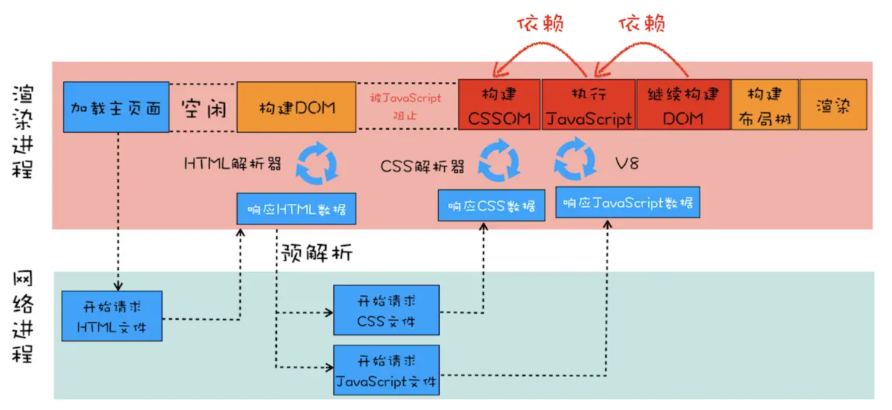

## 浏览器运行

### 浏览器的组成

了解浏览器的运行，首先要先了解浏览器的组成。浏览器由`shell`(命令解析代理，简单来说就是`代理用户对内核的操作`)和浏览器`内核`组成。

shell 组成：

- 用户界面：除浏览器请求的页面以外，都属于用户界面。
- 网络：用于网络请求，包含多种文件传输协议，如HTTP、FTP等。
- UI后端：用于绘制''对话框''等基本组件。
- JS解释器：解释并执行网页中的javascript代码
- XML解析器：将XML文档解析成文档对象模型(DOM)
- 数据存储：将浏览器数据存储在硬盘上

内核组成：
- 浏览器引擎：为渲染引擎提供高级接口

- 渲染引擎：负责显示请求的内容。负责解析请求到的HTML、CSS 并将其显示

### 浏览器中的进程

除了浏览器的组成，在谈到一段程序在计算机中的运行时，那必须提到`进程`的概念

**进程**：

### 浏览器的网络请求

### 浏览器的渲染过程

> Html解析，解析DOM树

将原始字符转换成对应的节点对象，后将节点对象构建成树状结构

> CSS解析，生成CSSOM树

> Render Tree]

将DOM树和CSSOM树结合形成渲染树

> layout 

根据已知的节点和样式，计算节点在浏览器中的大小和位置

从渲染树根节点开始遍历，用盒子模型表示各节点之间的距离，确定其位置和大小

> Paint

将渲染树绘制

#### load和DomContentload事件

load：在所有资源加载完成后触发

domcontentload：在html被**解析完成**后触发

#### js和css对渲染的影响

js会阻碍DOM树生成，阻碍图片，js，css等资源的加载

css会阻塞CSSOM生成，阻碍页面渲染，阻碍js**执行**

### 浏览器的同源策略

### 浏览器的安全

### 浏览器的存储

### 浏览器的垃圾回收机制

### 番外：抽象语法树的编译

