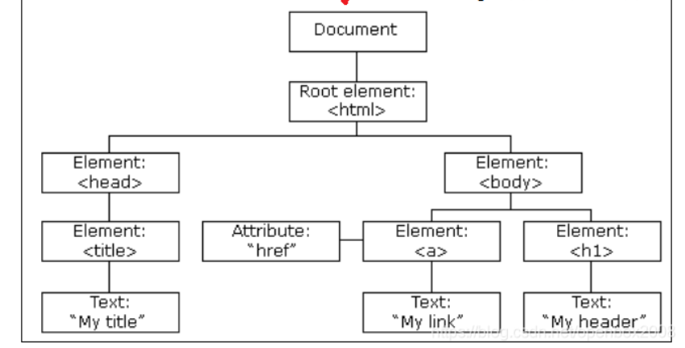
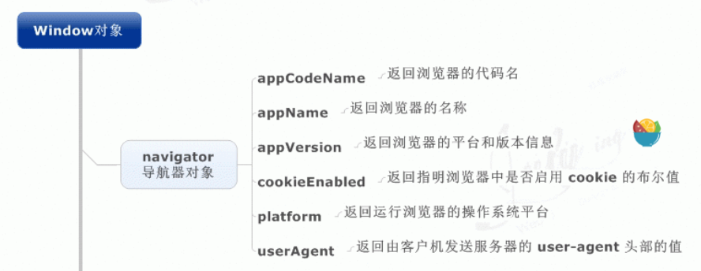
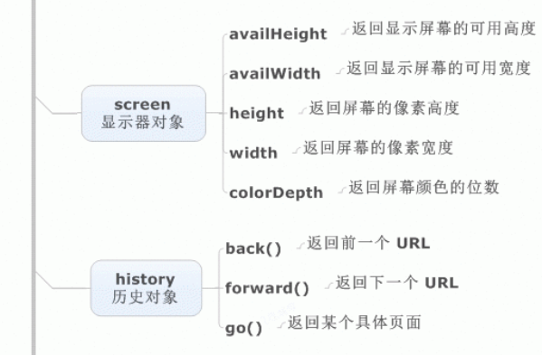
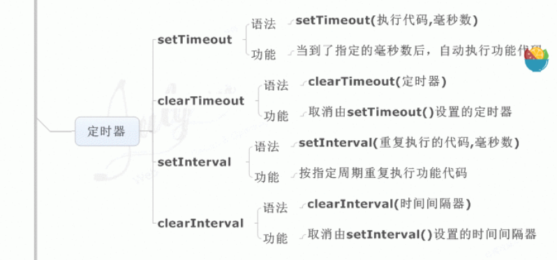
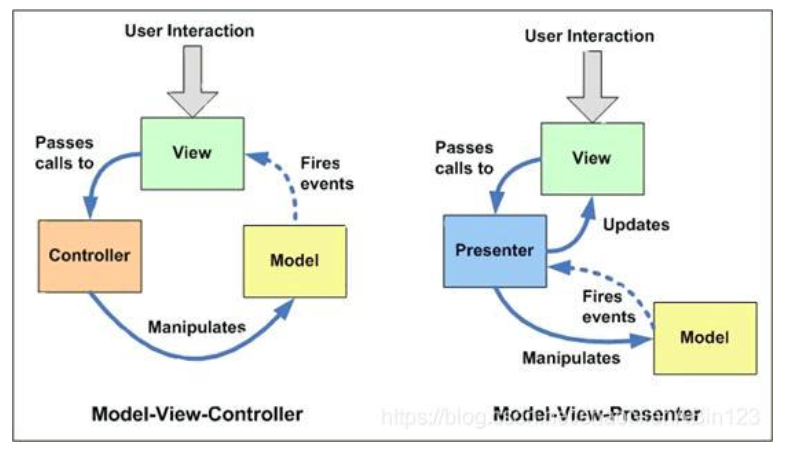

# 对[掘金大佬](https://juejin.cn/post/6996841019094335519#heading-12)的总结重新梳理排版

## JavaScript

### 1-1 js的数据类型有哪些，区别

number，string，boolean，object，undefined，null，symbol，bigint

symbol 代表创建后独一无二的数据类型，解决全局变量冲突问题

bigint可以表示任意精度格式的整数

原始数据类型：undefined，null，boolean，number，string

引用数据类型：对象，数组，函数

前者，存储在栈中，频繁使用

后者，存储在堆中，占据空间大，大小不固定，栈中存储该对象指针，指针指向堆的实体地址

### 1-2 数据类型检测方式

typeof，对象，数组，null会被判断成object，其余类型判断正确

instanceof，判断原型链上是否能找到该类型的原型

```js
console.log(2 instanceof Number);                    // false
console.log(new Number(2) instanceof Number); //true
```

constructor, 判断对象的构造函数

```js
console.log((2).constructor === Number); // true		
```

### 1-3 判断数组的方式

```js
object.__proto__ == Array.prototype
Array.isArray(obj)
obj instacneof Array
```

### 1-4 null 和undefined区别

undefined 未定义，null空值

typeof null //object

### 1-5 instanceof实现原理和实现

```js
function myinstanceof(left, right){
	let proto = Object.getPrototypeof(left);
    let prototype = right.prototype;
    while(true){
        if(!proto) return false;
        if(proto == prototype) return true;
        proto = Object.getPrototype(proto);
    }
}
```

### 1-6 为什么0.1 + 0.2 != 0.3 

(n1 + n2).toFixed(2)//保留几位小数

js机器精度 Number.EPSILON

```js
function numberepsilon(arg1,arg2){                   
  return Math.abs(arg1 - arg2) < Number.EPSILON;        
}        

console.log(numberepsilon(0.1 + 0.2, 0.3)); // true
```


### 1-7 ==操作符的强制类型转换规则

1、首先会判断两者类型是否相同，相同的话就比较两者的大小
2、类型不相同的话，就会进行[类型转换](https://so.csdn.net/so/search?q=类型转换&spm=1001.2101.3001.7020)
3、会先判断是否在对比 null 和 undefined ，是的话就返回true
4、判断两者类型是否为 string 和 number，是的话就会将[字符串](https://so.csdn.net/so/search?q=字符串&spm=1001.2101.3001.7020)转换为number
5、判断其中一方是否为[boolean](https://so.csdn.net/so/search?q=boolean&spm=1001.2101.3001.7020),是的话就会把 boolean 转为 number 再进行判断
6、判断其中一方是否为object 且另一方为 string、number、或者symbol，是的话就会把 object 转为原始类型再进行判断

### 1-8 Object.is()和比较运算符的区别

- 使用双等号（==）进行相等判断时，如果两边的类型不一致，则会进行强制类型转化后再进行比较。

- 使用三等号（===）进行相等判断时，如果两边的类型不一致时，不会做强制类型准换，直接返回 false。

- 使用 Object.is 来进行相等判断时，一般情况下和三等号的判断相同，它处理了一些特殊的情况，比如 -0 和 +0 不再相等，两个 NaN 是相等的。

  `Object.is(-0,+0) //false`

### 1-9 new操作符的实现原理

```js
function mynew(fn,...arg){
	let obj = {};
	obj.__proto__ == fn.prototype;
	let res = fn.apply(obj,arg);
	return res instanceof Object : res ? obj;
}
new 与 Objectcreate的区别
1.new 只接受 改造函数，后者除构造函数外，还可以接收普通对象
2.后者传入构造函数 不会继承构造函数的属性，前者传入对象会继承对象的属性
3.后者可以实现没有原型的空对象
```

### 1-10 数组常见的原生方法

toString(),toLocalString(),join()

pop(),push(),shifit,unshift()

concat(),slice(),splice(),indexOf(),every(),some()

### 1-11 什么是BOM和DOM

DOM文档对象模型，定义了处理网页内容的方法和接口


BOM，浏览器对象模型，定义了与浏览器进行交互的方法和接口

BOM中的核心对象是 window对象(子对象，document、location、navigator、screen、history、frames)








### 1-12 对类数组对象的理解，如何转为数组

一个拥有length属性和若干索引属性的对象叫做类数组对象，但不能调用数组的方法

```js
//转数组的方法
Array.prototype.slice.call(arraylike)
Array.prototype.concat.apply([], arrayLike);
```

### 1-13 对ajax的理解，实现一个ajax请求

1. 创建XMLHttpRequest对象

2. 在该对象上使用open方法创建一个HTTP请求

3. 调用send发送请求

4. 判断相应数据并进行操作

```js
   let xhr = new XMLHttpRequest();
   xhr.open('get','http://127.0.0.1',true);
   xhr.send()
   xhr.onreadystatechange = function(){
       if(xhr.readystate === 4){
           if(xhr.state === '200' || xhr,state === '304'){
               console.log(xhr.response)
           }
           else{
               console.log(xhr)
           }
       }
   }
   //promise实现
   let ajax = (method,url) => {
       return new Promise((resolve,reject)=>{
           let xhr = new XMLHttpRequest();
           xhr.open(method,url);
           xhr.send();
           xhr.onreadystatechange = function(){
               if(xhr.readystate == 4){
                   if(xhr.state == 200 || xhr.state == 304){
                       resolve(xhr.response);
                   }
                   else{
                       reject(xhr);
                   }
               }
           }
       })
   }
```

   

### 1-14 js为什么要进行变量提升

js引擎在执行代码有解析过程，创建执行上下文

解析阶段，变量声明为undefined，函数声明好可使用

执行阶段，按照代码顺序执行

变量提升原因：

1.提高性能，仅需执行一次语法检查和预编译，避免每次执行代码前都要重新解析变量/函数

2.容错性好，可以先使用后定义变量

缺陷，会对全局变量的输出造成影响

```js
var tmp = new Date();

function fn(){
	console.log(tmp);
	if(false){
		var tmp = 'hello world';
	}
}

fn();  // undefined
```

### 1-15 let const var区别

1. 块级作用域：由{}包括，let const 有块级作用域，解决ES5中的问题，内层变量覆盖外部变量，循环变量泄露为全局变量
2. 变量提升，var存在变量提升
3. 暂时性死区，let const,在声明前均不可使用，存在暂时性死区
4. 重复声明，var重复声明变量，后者可覆盖前者，let const不允许

### 1-16 箭头函数和普通函数的区别

1. 箭头函数没有自己的this，只会在自己作用域上一层继承this
2. 箭头函数的this在定义时确定，且不会改变
3. 箭头函数不能做为构造函数使用，this无法用call改变，没有prototype属性

### 1-17 对原型和原型链的理解

原型包含了可以由该构造函数的所有实例共享的属性和方法


### 1-18 原型链的指向

```js
p.__proto__  // Person.prototype
Person.prototype.__proto__  // Object.prototype
p.__proto__.__proto__ //Object.prototype
p.__proto__.constructor.prototype.__proto__ // Object.prototype
Person.prototype.constructor.prototype.__proto__ // Object.prototype
p1.__proto__.constructor // Person
Person.prototype.constructor  // Person
```

### 1-19 对promise的理解

解决异步编程的一种方案，解决了回调地狱问题

三个状态：pending，resolved，rejected

promise是一个构造函数，接受一个函数作为参数，返回一个promise实例

### 1-20 promise的基本用法

创建promise对象;

```js
const promise = new Promise(function(resolve, reject) {
  // ... some code
  if (/* 异步操作成功 */){
    resolve(value);
  } else {
    reject(error);
  }
});
```

promise方法：

```js
//then()
promise.then(function(value) {
  // success
}, function(error) {
  // failure
});

//catch()
//相当于then的第二个参数，但在执行resolve报错时，会进入catch中，不会停止运行
p.then((data) => {
     console.log('resolved',data);
},(err) => {
     console.log('rejected',err);
     }
); 
p.then((data) => {
    console.log('resolved',data);
}).catch((err) => {
    console.log('rejected',err);
});

//all() 存在一个promise对象状态为rejected则返回rejected 否则返回resolve
let promise1 = new Promise((resolve,reject)=>{
	setTimeout(()=>{
       resolve(1);
	},2000)
});
let promise2 = new Promise((resolve,reject)=>{
	setTimeout(()=>{
       resolve(2);
	},1000)
});
let promise3 = new Promise((resolve,reject)=>{
	setTimeout(()=>{
       resolve(3);
	},3000)
});
Promise.all([promise1,promise2,promise3]).then(res=>{
    console.log(res);
    //结果为：[1,2,3] 
})

//race() 第一个返回的promise是啥就是啥
let promise1 = new Promise((resolve,reject)=>{
	setTimeout(()=>{
       reject(1);
	},2000)
});
let promise2 = new Promise((resolve,reject)=>{
	setTimeout(()=>{
       resolve(2);
	},1000)
});
let promise3 = new Promise((resolve,reject)=>{
	setTimeout(()=>{
       resolve(3);
	},3000)
});
Promise.race([promise1,promise2,promise3]).then(res=>{
	console.log(res);
	//结果：2
},rej=>{
    console.log(rej)};
)

//finally 最后执行的动作
promise
.then(result => {···})
.catch(error => {···})
.finally(() => {···});
```

### 1-21 async和await的理解

async：

async函数返回的是一个promise对象，如果在函数中直接return一个直接量，async会直接将直接量通过promise.resolve()封装成promise对象。无返回值：返回 Promise.resolve(undefined)

await：

如果等待的不是一个promise对象，返回运算结果

如果是promise对象，await阻塞后面的代码(并且暂停async的执行)，等待promise对象resolve

### 1-22 async和await对promise的优势

具有依赖的异步代码会更加清晰

async/await捕获异常

```js
async function fn(){
    try{
        let a = await Promise.reject('error')
    }catch(error){
        console.log(error)
    }
}
```

### 1-23 对闭包的理解

闭包指有权访问另一个作用域中变量的函数

两个用途：

1. 在函数外部可以访问到函数内部的变量

```js
function A() {
  var a = "a";
  return function B() {
    console.log(a);
  }
}
var fun = A();
fun();

```

2. 使运行结束的函数上下文中的变量对象继续留在内存中

```js
function hd1(){
    let n = 1;
    return function sum(){
      console.log(++n);
    }
    sum();
  }
//tem1 指向hd1，js垃圾处理机制不会回收
  let tem1 = hd1();//此时为执行了hd1函数，返回了sum函数给了tem1
  tem1();//2
  tem1();//3
  tem1();//4
//新开辟一个内存空间
  let tem2 = hd1();//此时是新开辟了一个内存空间，n的起始值还是1
  tem2();//2
  tem2();//3
  
  tem1();//5
```

### 1-24 对作用域 作用域链的理解

1. 全局作用域

   - 最外层函数和最外层函数外面定义的变量拥有全局作用域
   - 所有未定义直接赋值的变量自动声明为全局作用域
   - 所有window对象的属性拥有全局作用域
   - 全局作用域有很大的弊端，过多的全局作用域变量会污染全局命名空间，容易引起命名冲突。

2. 函数作用域

   - 函数作用域声明在函数内部的变零，一般只有固定的代码片段可以访问到
   - 作用域是分层的，内层作用域可以访问外层作用域，反之不行

3. 块级作用域

   - 使用ES6中新增的let和const指令可以声明块级作用域，块级作用域可以在函数中创建也可以在一个代码块中的创建（由`{ }`包裹的代码片段）

   - let和const声明的变量不会有变量提升，也不可以重复声明

   - 在循环中比较适合绑定块级作用域，这样就可以把声明的计数器变量限制在循环内部。

4. 作用域链
   在当前作用域中找所需变量，没有则去父级作用域找，直到window对象为止

### 1-25 对执行上下文的理解

在执行一点JS代码之前，需要先解析代码。解析的时候会先创建一个全局执行上下文环境，先把代码中即将执行的变量、函数声明都拿出来，变量先赋值为undefined，函数先声明好可使用。这一步执行完了，才开始正式的执行程序。

在一个函数执行之前，也会创建一个函数执行上下文环境，跟全局执行上下文类似，不过函数执行上下文会多出this、arguments和函数的参数。

### 1-26 对this对象的理解

this 是执行上下文中的一个属性，它指向最后一次调用这个方法的对象。

- 第一种是**函数调用模式**，当一个函数不是一个对象的属性时，直接作为函数来调用时，this 指向全局对象。
- 第二种是**方法调用模式**，如果一个函数作为一个对象的方法来调用时，this 指向这个对象。
- 第三种是**构造器调用模式**，如果一个函数用 new 调用时，函数执行前会新创建一个对象，this 指向这个新创建的对象。
- 第四种是 **apply 、 call 和 bind 调用模式**，这三个方法都可以显示的指定调用函数的 this 指向。其中 apply 方法接收两个参数：一个是 this 绑定的对象，一个是参数数组。call 方法接收的参数，第一个是 this 绑定的对象，后面的其余参数是传入函数执行的参数。也就是说，在使用 call() 方法时，传递给函数的参数必须逐个列举出来。bind 方法通过传入一个对象，返回一个 this 绑定了传入对象的新函数。这个函数的 this 指向除了使用 new 时会被改变，其他情况下都不会改变。

### 1-27 call和apply的区别

作用一模一样，区别仅在于传入参数的形式的不同。

### 1-28 实现call apply bind

**（1）call 函数的实现步骤：**

- 判断调用对象是否为函数，即使是定义在函数的原型上的，但是可能出现使用 call 等方式调用的情况。
- 判断传入上下文对象是否存在，如果不存在，则设置为 window 。
- 处理传入的参数，截取第一个参数后的所有参数。
- 将函数作为上下文对象的一个属性。
- 使用上下文对象来调用这个方法，并保存返回结果。
- 删除刚才新增的属性。
- 返回结果。

```javascript
Function.prototype.myCall = function(context) {
  // 判断调用对象
  if (typeof this !== "function") {
    console.error("type error");
  }
  // 获取参数
  let args = [...arguments].slice(1),
    result = null;
  // 判断 context 是否传入，如果未传入则设置为 window
  context = context || window;
  // 将调用函数设为对象的方法
  context.fn = this;
  // 调用函数
  result = context.fn(...args);
  // 将属性删除
  delete context.fn;
  return result;
};
```

**（2）apply 函数的实现步骤：**

- 判断调用对象是否为函数，即使是定义在函数的原型上的，但是可能出现使用 call 等方式调用的情况。
- 判断传入上下文对象是否存在，如果不存在，则设置为 window 。
- 将函数作为上下文对象的一个属性。
- 判断参数值是否传入
- 使用上下文对象来调用这个方法，并保存返回结果。
- 删除刚才新增的属性
- 返回结果

```javascript
Function.prototype.myApply = function(context) {
  // 判断调用对象是否为函数
  if (typeof this !== "function") {
    throw new TypeError("Error");
  }
  let result = null;
  // 判断 context 是否存在，如果未传入则为 window
  context = context || window;
  // 将函数设为对象的方法
  context.fn = this;
  // 调用方法
  if (arguments[1]) {
    result = context.fn(...arguments[1]);
  } else {
    result = context.fn();
  }
  // 将属性删除
  delete context.fn;
  return result;
};
```

**（3）bind 函数的实现步骤：**

- 判断调用对象是否为函数，即使是定义在函数的原型上的，但是可能出现使用 call 等方式调用的情况。
- 保存当前函数的引用，获取其余传入参数值。
- 创建一个函数返回
- 函数内部使用 apply 来绑定函数调用，需要判断函数作为构造函数的情况，这个时候需要传入当前函数的 this 给 apply 调用，其余情况都传入指定的上下文对象。

```javascript
Function.prototype.myBind = function(context) {
  // 判断调用对象是否为函数
  if (typeof this !== "function") {
    throw new TypeError("Error");
  }
  // 获取参数
  var args = [...arguments].slice(1),
    fn = this;
  return function Fn() {
    // 根据调用方式，传入不同绑定值
    return fn.apply(
      this instanceof Fn ? this : context,
      args.concat(...arguments)
    );
  };
};
```

### 1-29 浏览器的垃圾回收机制

#### （1）垃圾回收的概念

**垃圾回收**：JavaScript代码运行时，需要分配内存空间来储存变量和值。当变量不在参与运行时，就需要系统收回被占用的内存空间，这就是垃圾回收。

**回收机制**：

- Javascript 具有自动垃圾回收机制，会定期对那些不再使用的变量、对象所占用的内存进行释放，原理就是找到不再使用的变量，然后释放掉其占用的内存。
- JavaScript中存在两种变量：局部变量和全局变量。全局变量的生命周期会持续要页面卸载；而局部变量声明在函数中，它的生命周期从函数执行开始，直到函数执行结束，在这个过程中，局部变量会在堆或栈中存储它们的值，当函数执行结束后，这些局部变量不再被使用，它们所占有的空间就会被释放。
- 不过，当局部变量被外部函数使用时，其中一种情况就是闭包，在函数执行结束后，函数外部的变量依然指向函数内部的局部变量，此时局部变量依然在被使用，所以不会回收。

#### （2）垃圾回收的方式

浏览器通常使用的垃圾回收方法有两种：标记清除，引用计数。 **1）标记清除**

- 标记清除是浏览器常见的垃圾回收方式，当变量进入执行环境时，就标记这个变量“进入环境”，被标记为“进入环境”的变量是不能被回收的，因为他们正在被使用。当变量离开环境时，就会被标记为“离开环境”，被标记为“离开环境”的变量会被内存释放。
- 垃圾收集器在运行的时候会给存储在内存中的所有变量都加上标记。然后，它会去掉环境中的变量以及被环境中的变量引用的标记。而在此之后再被加上标记的变量将被视为准备删除的变量，原因是环境中的变量已经无法访问到这些变量了。最后。垃圾收集器完成内存清除工作，销毁那些带标记的值，并回收他们所占用的内存空间。

**2）引用计数**

- 另外一种垃圾回收机制就是引用计数，这个用的相对较少。引用计数就是跟踪记录每个值被引用的次数。当声明了一个变量并将一个引用类型赋值给该变量时，则这个值的引用次数就是1。相反，如果包含对这个值引用的变量又取得了另外一个值，则这个值的引用次数就减1。当这个引用次数变为0时，说明这个变量已经没有价值，因此，在在机回收期下次再运行时，这个变量所占有的内存空间就会被释放出来。
- 这种方法会引起**循环引用**的问题：例如：` obj1`和`obj2`通过属性进行相互引用，两个对象的引用次数都是2。当使用循环计数时，由于函数执行完后，两个对象都离开作用域，函数执行结束，`obj1`和`obj2`还将会继续存在，因此它们的引用次数永远不会是0，就会引起循环引用。

```javascript
function fun() {
    let obj1 = {};
    let obj2 = {};
    obj1.a = obj2; // obj1 引用 obj2
    obj2.a = obj1; // obj2 引用 obj1
}
```

这种情况下，就要手动释放变量占用的内存：

```javascript
obj1.a =  null
obj2.a =  null
```

#### （3）减少垃圾回收

虽然浏览器可以进行垃圾自动回收，但是当代码比较复杂时，垃圾回收所带来的代价比较大，所以应该尽量减少垃圾回收。

- **对数组进行优化：** 在清空一个数组时，最简单的方法就是给其赋值为[ ]，但是与此同时会创建一个新的空对象，可以将数组的长度设置为0，以此来达到清空数组的目的。
- **对**`object`**进行优化：** 对象尽量复用，对于不再使用的对象，就将其设置为null，尽快被回收。
- **对函数进行优化：** 在循环中的函数表达式，如果可以复用，尽量放在函数的外面。

### 2-1 typeof null 结果是什么 为什么

typeof null 的结果是Object。

在 JavaScript 第一个版本中，所有值都存储在 32 位的单元中，每个单元包含一个小的 **类型标签(1-3 bits)** 以及当前要存储值的真实数据。类型标签存储在每个单元的低位中，共有五种数据类型：

```javascript
000: object   - 当前存储的数据指向一个对象。
  1: int      - 当前存储的数据是一个 31 位的有符号整数。
010: double   - 当前存储的数据指向一个双精度的浮点数。
100: string   - 当前存储的数据指向一个字符串。
110: boolean  - 当前存储的数据是布尔值。
```

如果最低位是 1，则类型标签标志位的长度只有一位；如果最低位是 0，则类型标签标志位的长度占三位，为存储其他四种数据类型提供了额外两个 bit 的长度。

有两种特殊数据类型：

- undefined的值是 (-2)30(一个超出整数范围的数字)；
- null 的值是机器码 NULL 指针(null 指针的值全是 0)

那也就是说null的类型标签也是000，和Object的类型标签一样，所以会被判定为Object。

### 2-2 isNaN和Number.isNaN函数的区别

函数 isNaN 接收参数后，会尝试将这个参数转换为数值，任何不能被转换为数值的的值都会返回 true，因此非数字值传入也会返回 true ，会影响 NaN 的判断。

函数 Number.isNaN 会首先判断传入参数是否为数字，如果是数字再继续判断是否为 NaN ，不会进行数据类型的转换，这种方法对于 NaN 的判断更为准确。

### 2-3 其他值到字符串，数字，布尔值的转换规则

1. 到字符串
Null 和 Undefined 类型 ，null 转换为 "null"，undefined 转换为 "undefined"，
Boolean 类型，true 转换为 "true"，false 转换为 "false"。
Number 类型的值直接转换，不过那些极小和极大的数字会使用指数形式。
Symbol 类型的值直接转换，但是只允许显式强制类型转换，使用隐式强制类型转换会产生错误。
2. 到数字
Undefined 类型的值转换为 NaN。
Null 类型的值转换为 0。
Boolean 类型的值，true 转换为 1，false 转换为 0。
String 类型的值转换如同使用 Number() 函数进行转换，如果包含非数字值则转换为 NaN，空字符串为 0。
Symbol 类型的值不能转换为数字，会报错。
3. 到布尔值
以下这些是假值： • undefined • null • false • +0、-0 和 NaN • ""
假值的布尔强制类型转换结果为 false。从逻辑上说，假值列表以外的都应该是真值。

### 2-4 js中如何进行隐式的数据转换

1. `+`**操作符** `+`操作符的两边有至少一个`string`类型变量时，两边的变量都会被隐式转换为字符串；其他情况下两边的变量都会被转换为数字。
2. **对于**`==`**操作符**，操作符两边的值都尽量转成`number`
3. **对于**`<`**和**`>`**比较符**，如果两边都是字符串，则比较字母表顺序，其他情况下，转换为数字再比较

### 2-5 map和Object的区别

Object：是最常用的一种引用类型数据，可用于存储键值对的集合
Map：是键值对的集合，采用Hash结构存储

共同点：
键值对的动态集合，支持增加删除键值对

不同点：

1. 构造方式

```js
Object:
const o = new Object(); // 构造方法
const o2 = Object.create();
const obj = {'a': '1'}
```
```js
Map
const m = new Map(); // 构造方法
const m2 = new Map([['a', '1'],['b','2']])

```
2. 键的类型
   Object：键类型必须是string或者Symbol，如果非String类型，会进行数据类型转换
   Map：键可以是任意类型，包括对象，数组，函数等。不会进行数据类型转换。
   在添加键值对时，会通过严格相等 === 来判断键属性是否已经存在
3. 键的顺序
   Object：key是无序的，不会按照添加到顺序返回
   Map：key是有序的，按照插入的顺序返回
4. 键值对size
   Object：只能手动计算，通过Object.keys()方法或者通过for…in循环统计
   Map：直接通过size属性访问

### 2-6 js脚本延迟的方式有哪些

延迟加载就是等页面加载完成之后再加载 JavaScript 文件。 js 延迟加载有助于提高页面加载速度。

一般有以下几种方式：

- **defer 属性：** 给 js 脚本添加 defer 属性，这个属性会让脚本的加载与文档的解析同步解析，然后在文档解析完成后再执行这个脚本文件，这样的话就能使页面的渲染不被阻塞。多个设置了 defer 属性的脚本按规范来说最后是顺序执行的，但是在一些浏览器中可能不是这样。
- **async 属性：** 给 js 脚本添加 async 属性，这个属性会使脚本异步加载，不会阻塞页面的解析过程，但是当脚本加载完成后立即执行 js 脚本，这个时候如果文档没有解析完成的话同样会阻塞。多个 async 属性的脚本的执行顺序是不可预测的，一般不会按照代码的顺序依次执行。
- **动态创建 DOM 方式：** 动态创建 DOM 标签的方式，可以对文档的加载事件进行监听，当文档加载完成后再动态的创建 script 标签来引入 js 脚本。
- **使用 setTimeout 延迟方法：** 设置一个定时器来延迟加载js脚本文件
- **让 JS 最后加载：** 将 js 脚本放在文档的底部，来使 js 脚本尽可能的在最后来加载执行。

### 2-7 js类数组对象的定义

一个拥有 length 属性和若干索引属性的对象就可以被称为类数组对象，类数组对象和数组类似，但是不能调用数组的方法。常见的类数组对象有 arguments 和 DOM 方法的返回结果，还有一个函数也可以被看作是类数组对象，因为它含有 length 属性值，代表可接收的参数个数。

### 2-8 函数的argument参数是类数组而不是数组，如何遍历数组

`arguments`是一个对象，它的属性是从 0 开始依次递增的数字，还有`callee`和`length`等属性，与数组相似；但是它却没有数组常见的方法属性，如`forEach`, `reduce`等，所以叫它们类数组。

（1）将数组的方法应用到类数组上，可以使用`call`和`apply`方法

（2）使用Array.from方法将类数组转化成数组

（3）使用展开运算符将类数组转化成数组

### 2-9 ES6和CommonJS模块的异同

ES6 Module和CommonJS模块的区别：

- CommonJS是对模块的浅拷⻉，ES6 Module是对模块的引⽤，即ES6 Module只存只读，不能改变其值，也就是指针指向不能变，类似const；
- import的接⼝是read-only（只读状态），不能修改其变量值。 即不能修改其变量的指针指向，但可以改变变量内部指针指向，可以对commonJS对重新赋值（改变指针指向），但是对ES6 Module赋值会编译报错。

ES6 Module和CommonJS模块的共同点：

- CommonJS和ES6 Module都可以对引⼊的对象进⾏赋值，即对对象内部属性的值进⾏改变。

### 2-10 如何判断一个对象属于某个类

第一种方式，使用 instanceof 运算符来判断构造函数的 prototype 属性是否出现在对象的原型链中的任何位置。

第二种方式，通过对象的 constructor 属性来判断，对象的 constructor 属性指向该对象的构造函数，但是这种方式不是很安全，因为 constructor 属性可以被改写。

第三种方式，如果需要判断的是某个内置的引用类型的话，可以使用 Object.prototype.toString() 方法来打印对象的[[Class]] 属性来进行判断。

### 2-11 for in 和for of 区别

for…of 是ES6新增的遍历方式，允许遍历一个含有iterator接口的数据结构（数组、对象等）并且返回各项的值，和ES3中的for…in的区别如下

- for…of 遍历获取的是对象的键值，for…in 获取的是对象的键名；
- for… in 会遍历对象的整个原型链，性能非常差不推荐使用，而 for … of 只遍历当前对象不会遍历原型链；
- 对于数组的遍历，for…in 会返回数组中所有可枚举的属性(包括原型链上可枚举的属性)，for…of 只返回数组的下标对应的属性值；

**总结：** for...in 循环主要是为了遍历对象而生，不适用于遍历数组；for...of 循环可以用来遍历数组、类数组对象，字符串、Set、Map 以及 Generator 对象。

### 2-12 数组遍历的方法有哪些

| **方法**                  | **是否改变原数组** | **特点**                                                     |
| ------------------------- | ------------------ | ------------------------------------------------------------ |
| forEach()                 | 否                 | 数组方法，不改变原数组，没有返回值                           |
| map()                     | 否                 | 数组方法，不改变原数组，有返回值，可链式调用                 |
| filter()                  | 否                 | 数组方法，过滤数组，返回包含符合条件的元素的数组，可链式调用 |
| for...of                  | 否                 | for...of遍历具有Iterator迭代器的对象的属性，返回的是数组的元素、对象的属性值，不能遍历普通的obj对象，将异步循环变成同步循环 |
| every() 和 some()         | 否                 | 数组方法，some()只要有一个是true，便返回true；而every()只要有一个是false，便返回false. |
| find() 和 findIndex()     | 否                 | 数组方法，find()返回的是第一个符合条件的值；findIndex()返回的是第一个返回条件的值的索引值 |
| reduce() 和 reduceRight() | 否                 | 数组方法，reduce()对数组正序操作；reduceRight()对数组逆序操作 |

### 2-13 foreach和map方法有什么不同

这方法都是用来遍历数组的，两者区别如下：

- forEach()方法会针对每一个元素执行提供的函数，对数据的操作会改变原数组，该方法没有返回值；
- map()方法不会改变原数组的值，返回一个新数组，新数组中的值为原数组调用函数处理之后的值；

### 2-14 const对象可以更改吗

const保证的并不是变量的值不能改动，而是变量指向的那个内存地址不能改动。对于基本类型的数据（数值、字符串、布尔值），其值就保存在变量指向的那个内存地址，因此等同于常量。

但对于引用类型的数据（主要是对象和数组）来说，变量指向数据的内存地址，保存的只是一个指针，const只能保证这个指针是固定不变的，至于它指向的数据结构是不是可变的，就完全不能控制了。

### 2-15 new一个箭头函数会怎样

箭头函数是ES6中的提出来的，它没有prototype，也没有自己的this指向，更不可以使用arguments参数，所以不能New一个箭头函数。

### 2-16 箭头函数的this指向哪里

箭头函数不同于传统JavaScript中的函数，箭头函数并没有属于⾃⼰的this，它所谓的this是捕获其所在上下⽂的 this 值，作为⾃⼰的 this 值，并且由于没有属于⾃⼰的this，所以是不会被new调⽤的，这个所谓的this也不会被改变。

### 2-17 对 rest 参数的理解

扩展运算符被用在函数形参上时，**它还可以把一个分离的参数序列整合成一个数组**

### 2-18 ES6模板语法和字符串的处理

- 在模板字符串中，空格、缩进、换行都会被保留
- 模板字符串完全支持“运算”式的表达式，可以在${}里完成一些计算
- 基于第一点，可以在模板字符串里无障碍地直接写 html 代码
- 基于第二点，可以把一些简单的计算和调用丢进 ${} 来做

### 2-19 原型的修改重写

```js
function Person(name) {
    this.name = name
}
// 修改原型
Person.prototype.getName = function() {}
var p = new Person('hello')
console.log(p.__proto__ === Person.prototype) // true
console.log(p.__proto__ === p.constructor.prototype) // true
// 重写原型
Person.prototype = {
    getName: function() {}
}
var p = new Person('hello')
console.log(p.__proto__ === Person.prototype)        // true
console.log(p.__proto__ === p.constructor.prototype) // false
```

### 2-20 异步编程的方式

**回调函数** 的方式，使用回调函数的方式有一个缺点是，多个回调函数嵌套的时候会造成回调函数地狱，上下两层的回调函数间的代码耦合度太高，不利于代码的可维护。

**Promise** 的方式，使用 Promise 的方式可以将嵌套的回调函数作为链式调用。但是使用这种方法，有时会造成多个 then 的链式调用，可能会造成代码的语义不够明确。

**generator** 的方式，它可以在函数的执行过程中，将函数的执行权转移出去，在函数外部还可以将执行权转移回来。当遇到异步函数执行的时候，将函数执行权转移出去，当异步函数执行完毕时再将执行权给转移回来。因此在 generator 内部对于异步操作的方式，可以以同步的顺序来书写。使用这种方式需要考虑的问题是何时将函数的控制权转移回来，因此需要有一个自动执行 generator 的机制，比如说 co 模块等方式来实现 generator 的自动执行。

**async 函数** 的方式，async 函数是 generator 和 promise 实现的一个自动执行的语法糖，它内部自带执行器，当函数内部执行到一个 await 语句的时候，如果语句返回一个 promise 对象，那么函数将会等待 promise 对象的状态变为 resolve 后再继续向下执行。因此可以将异步逻辑，转化为同步的顺序来书写，并且这个函数可以自动执行。

### 2-21 await在等什么

**await 在等待什么呢？** 一般来说，都认为 await 是在等待一个 async 函数完成。不过按语法说明，await 等待的是一个表达式，这个表达式的计算结果是 Promise 对象或者其它值（换句话说，就是没有特殊限定）。

### 2-22 async/await的优势

单一的 Promise 链并不能发现 async/await 的优势，但是，如果需要处理由多个 Promise 组成的 then 链的时候,代码看起来会清晰得多，几乎跟同步代码一样

### 2-23 对象创建方式有哪些

一般使用字面量的形式直接创建对象，但是这种创建方式对于创建大量相似对象的时候，会产生大量的重复代码。但 js和一般的面向对象的语言不同，在 ES6 之前它没有类的概念。但是可以使用函数来进行模拟，从而产生出可复用的对象创建方式，常见的有以下几种：

（1）第一种是工厂模式，工厂模式的主要工作原理是用函数来封装创建对象的细节，从而通过调用函数来达到复用的目的。但是它有一个很大的问题就是创建出来的对象无法和某个类型联系起来，它只是简单的封装了复用代码，而没有建立起对象和类型间的关系。

（2）第二种是构造函数模式。js 中每一个函数都可以作为构造函数，只要一个函数是通过 new 来调用的，那么就可以把它称为构造函数。执行构造函数首先会创建一个对象，然后将对象的原型指向构造函数的 prototype 属性，然后将执行上下文中的 this 指向这个对象，最后再执行整个函数，如果返回值不是对象，则返回新建的对象。因为 this 的值指向了新建的对象，因此可以使用 this 给对象赋值。构造函数模式相对于工厂模式的优点是，所创建的对象和构造函数建立起了联系，因此可以通过原型来识别对象的类型。但是构造函数存在一个缺点就是，造成了不必要的函数对象的创建，因为在 js 中函数也是一个对象，因此如果对象属性中如果包含函数的话，那么每次都会新建一个函数对象，浪费了不必要的内存空间，因为函数是所有的实例都可以通用的。

（3）第三种模式是原型模式，因为每一个函数都有一个 prototype 属性，这个属性是一个对象，它包含了通过构造函数创建的所有实例都能共享的属性和方法。因此可以使用原型对象来添加公用属性和方法，从而实现代码的复用。这种方式相对于构造函数模式来说，解决了函数对象的复用问题。但是这种模式也存在一些问题，一个是没有办法通过传入参数来初始化值，另一个是如果存在一个引用类型如 Array 这样的值，那么所有的实例将共享一个对象，一个实例对引用类型值的改变会影响所有的实例。

（4）第四种模式是组合使用构造函数模式和原型模式，这是创建自定义类型的最常见方式。因为构造函数模式和原型模式分开使用都存在一些问题，因此可以组合使用这两种模式，通过构造函数来初始化对象的属性，通过原型对象来实现函数方法的复用。这种方法很好的解决了两种模式单独使用时的缺点，但是有一点不足的就是，因为使用了两种不同的模式，所以对于代码的封装性不够好。

（5）第五种模式是动态原型模式，这一种模式将原型方法赋值的创建过程移动到了构造函数的内部，通过对属性是否存在的判断，可以实现仅在第一次调用函数时对原型对象赋值一次的效果。这一种方式很好地对上面的混合模式进行了封装。

（6）第六种模式是寄生构造函数模式，这一种模式和工厂模式的实现基本相同，我对这个模式的理解是，它主要是基于一个已有的类型，在实例化时对实例化的对象进行扩展。这样既不用修改原来的构造函数，也达到了扩展对象的目的。它的一个缺点和工厂模式一样，无法实现对象的识别。

### 2-24 对象继承方式有哪些

（1）第一种是以原型链的方式来实现继承，但是这种实现方式存在的缺点是，在包含有引用类型的数据时，会被所有的实例对象所共享，容易造成修改的混乱。还有就是在创建子类型的时候不能向超类型传递参数。

（2）第二种方式是使用借用构造函数的方式，这种方式是通过在子类型的函数中调用超类型的构造函数来实现的，这一种方法解决了不能向超类型传递参数的缺点，但是它存在的一个问题就是无法实现函数方法的复用，并且超类型原型定义的方法子类型也没有办法访问到。

（3）第三种方式是组合继承，组合继承是将原型链和借用构造函数组合起来使用的一种方式。通过借用构造函数的方式来实现类型的属性的继承，通过将子类型的原型设置为超类型的实例来实现方法的继承。这种方式解决了上面的两种模式单独使用时的问题，但是由于我们是以超类型的实例来作为子类型的原型，所以调用了两次超类的构造函数，造成了子类型的原型中多了很多不必要的属性。

（4）第四种方式是原型式继承，原型式继承的主要思路就是基于已有的对象来创建新的对象，实现的原理是，向函数中传入一个对象，然后返回一个以这个对象为原型的对象。这种继承的思路主要不是为了实现创造一种新的类型，只是对某个对象实现一种简单继承，ES5 中定义的 Object.create() 方法就是原型式继承的实现。缺点与原型链方式相同。

（5）第五种方式是寄生式继承，寄生式继承的思路是创建一个用于封装继承过程的函数，通过传入一个对象，然后复制一个对象的副本，然后对象进行扩展，最后返回这个对象。这个扩展的过程就可以理解是一种继承。这种继承的优点就是对一个简单对象实现继承，如果这个对象不是自定义类型时。缺点是没有办法实现函数的复用。

（6）第六种方式是寄生式组合继承，组合继承的缺点就是使用超类型的实例做为子类型的原型，导致添加了不必要的原型属性。寄生式组合继承的方式是使用超类型的原型的副本来作为子类型的原型，这样就避免了创建不必要的属性。

### 2-25 哪些情况会导致内存泄露

**意外的全局变量：** 由于使用未声明的变量，而意外的创建了一个全局变量，而使这个变量一直留在内存中无法被回收。

**被遗忘的计时器或回调函数：** 设置了 setInterval 定时器，而忘记取消它，如果循环函数有对外部变量的引用的话，那么这个变量会被一直留在内存中，而无法被回收。

**脱离 DOM 的引用：** 获取一个 DOM 元素的引用，而后面这个元素被删除，由于一直保留了对这个元素的引用，所以它也无法被回收。

**闭包：** 不合理的使用闭包，从而导致某些变量一直被留在内存当中。

## Css

### 1-1 选择器及其优先级

#id	.class	:link	div	兄弟h1+p	子ul>li	后代li a	通配符 *

内联样式>内部样式>外部样式

权重：内联1000	id100	类伪类属性10	标签伪元素1

### 1-2 display属性值及其使用

none：不显示，从文档流中删除

inline：默认宽度为内容宽度，不可设置宽高，同行显示，可设置水平方向的margin和padding属性

block：默认宽度为父元素宽度，换行显示

inline-block：默认宽度为内容宽度，可设置宽高，同行显示

### 1-3 	隐藏元素的方法

display：none

渲染树不会渲染该对象，不会在页面中占据位置，不会响应监听事件，**不可继承**

visibility：hidden

在页面中占据空间，但不会响应事件 **可继承**

opacity：0

将元素透明度设置为0，占据空间且可以响应事件

z-index：负值

用其他元素遮挡该元素

transform：scale（0,0）

缩放为0，占据位置，但不响应事件

### 1-4 盒模型的理解

box-sizeing：content-box 标准盒模型

width和height范围只包含content

box-sizeing：border-box 怪异盒模型

width和height范围包含border margin padding


### 1-4 CSS3中有哪些特性

圆角：border-radius：8px

旋转，倾斜，位移，缩放：transform

文字特效：text-shadow

### 1-5 单行 多行文本溢出

```css
//单行溢出
overflow:hidden;	//溢出隐藏
text-overflow:ellipsis //文本溢出用省略号表示
white-space:nowrap //规定文本不进行换行

//多行溢出
overflow:hidden
text-overflow:ellipsis
display:-webkit-box //作为弹性伸缩盒子的模型表示
-webkit-box-orient:vertical //伸缩盒子的子元素排列方式，从上到下垂直排列
-webkit-line-clamp;3 //显示的行数
```

### 1-6 两列布局

flex布局，左浮动右calc，左浮动右margin-left，左浮动右overflow(BFC的区域不会与float box重叠)

```html
<div class="container clearfix">
  <div class="left">定宽</div>
  <div class="right">自适应</div>
</div>
```

```css
body{
	margin:0
}
.container{
	height:400px
	background:#eebefa
}
.left{
	display:float //flex
	height:400px
	width:200px
	background-color:#f783ac
}
.right{
	width:calc(100% - 200px) // margin-left:200px // overflow:hidden
	//flex；1
	height:400px
	background-color；#c0b75
}
.clearfix:after{
	content:''
	display:block
	clear:both
}
···

```

### 1-7 三列布局

1.绝对定位，左右两栏绝对定位，中间设置margin

2.flex，左右固定大小，中间flex:1

3.浮动，左右固定大小设置浮动，中间设置margin(middle必须放在左右div后面，否则右边的div会掉下)

4.圣杯布局，父元素设置左右的padding，三列均设置浮动，middle设置为父元素宽度，并放在最前面。左右两个div被挤到下一行，两者使用margin负值将自身移到上一行，并使用相对定位，移动到两侧

```css
.outer {
  height: 100px;
  padding-left: 100px;
  padding-right: 200px;
}

.left {
  position: relative;
  left: -100px;

  float: left;
  margin-left: -100%;

  width: 100px;
  height: 100px;
  background: tomato;
}

.right {
  position: relative;
  left: 200px;

  float: right;
  margin-left: -200px;

  width: 200px;
  height: 100px;
  background: gold;
}

.center {
  float: left;

  width: 100%;
  height: 100px;
  background: lightgreen;
}
```

5.双飞翼布局，在middle外嵌套wrapper(设置浮动)，middle设置margin，两侧利用负边距提到上一层

```css
.outer {
  height: 100px;
}

.left {
  float: left;
  margin-left: -100%;

  width: 100px;
  height: 100px;
  background: tomato;
}

.right {
  float: left;
  margin-left: -200px;

  width: 200px;
  height: 100px;
  background: gold;
}

.wrapper {
  float: left;

  width: 100%;
  height: 100px;
  background: lightgreen;
}

.center {
  margin-left: 100px;
  margin-right: 200px;
  height: 100px;
}
```

### 1-8 水平垂直居中

1.利用绝对定位，将元素左上角通过top50，left50定位到页面中心，后通过transform调整元素中心点到页面中心

```css
.parent {    
	position: relative;
		} 
.child {    
	position: absolute;    
	left: 50%;    
	top: 50%;    
	transform: translate(-50%,-50%);
		}
```

2.利用绝对定位，设置四个方向都为0，将margin设为auto

```css
.parent {
    position: relative;
}
.child {
    position: absolute;
    top: 0;
    bottom: 0;
    left: 0;
    right: 0;
    margin: auto;
}
```

3.利用flex布局

```css
.parent {
    display: flex;
    justify-content:center;
    align-items:center;
}
```

### 1-8 如何清除浮动 清除浮动的方式

```css
,clear::after{
content:'';
display:block;
clear:both;
}
```

clear,元素盒子的边不能和`前面`浮动元素相邻

### 1-9 BFC的理解，如何创建BFC

块级格式上下文，独立容器，内部元素和外部互不干扰
1.创建条件：
元素设置浮动：float，设置绝对定位：absolute，fixed，设置overflow：hidden，scroll，auto
display：inline-block，flex
2.特点

- 垂直方向上自上而下，和标准文档流一样
- BFC中上下相邻的两个容器的margin会重叠
- BFC计算高度时，需要计算浮动元素的高度
- BFC区域不会和浮动的容器发生重叠
- BFC内部元素不会影响到外面
- 每个元素的左margin值和容器的左border相邻

### 1-10 position的属性有哪些，区别是什么

1.absolute，绝对定位，相对于第一个不为static的父元素

2.relative，相对定位

3.fixed，绝对定位，相对于屏幕视口

### 1-11 实现一个三角形

div的width，height设为0，border设置宽度，设置各个边颜色

### 1-12 如何解决1px问题

在retina屏幕上，1px会变粗，css的像素不能和移动设备上的相等

window.devicePixelRatio = 设备物理像素/css像素

```css
#container[data-device="2"] {
  border:0.5px solid #333
}
```


### 2-1 常见可继承与不可继承属性

可继承：

字体属性：font-size，font-weight，font-family

文本属性：text-align，line-height，color

不可继承：

盒子模型属性：width，height，margin，border，padding

背景属性：background

定位属性：float，clear，position，overflow

### 2-2 link 和@import的区别

link页面载入入时同时加载，支持js控制dom，还可定义RSS事务

@import在完全载入后加载，不支持改变样式

### 2-3 伪元素和伪类的区别和作用

伪元素：在内容元素前后插入额外的元素或样式

伪类：在已有元素上添加样式

### 2-4 常见图片格式和使用场景

BMP 无损 索引色，直接色 点阵图

GIF 无损 索引色，点阵图

JPEG 有损 直接色 点阵图

svg 矢量图，webp，有损无损直接色点阵图

### 2-5 对精灵图的理解

将页面的所有图片包含到一张大图上，利用css进行背景定位

优点：减少http请求，减少图片的字节

缺点：背景有改动时，需要修改图片

### 2-6 css预处理器的理解

结构清晰，便于拓展

方便的屏蔽浏览器私有语法的差异

### 2-7 对line-height的理解

一行文本的高度，若不定义height，高度由line-height决定

纯数字，将比例传给后代，后代字体为18px，比例1.5，子元素行高为27px

%，将计算后的值传给后代

### 2-8 对媒体查询的理解

@media，针对不同的媒体，定义不同的样式

### 2-9 常见css布局单位

px 像素 //适配少部分设备

% 子元素相对于父元素

em 相对于当前对象的文本字体尺寸

rem 相对于根元素的font-size // 适配多种设备

vw，vh相对于视口的宽高

### 2-10 什么是margin重叠问题，如何解决

两个块级元素的上边距和下边距折叠为一个外边距，大小会取外边距大的那个

兄弟之间重叠：

底部盒子设置为行内块

底部元素设置浮动

父子之间重叠：

父元素加入 overflow：hidden

父元素加透明边框 border：1px solid transport

子元素变为行内块

子元素设置浮动或定位

### 2-11 display，float，position的关系

display：none 》》 position：absolute/fixed 》》float

### 2-12 实现一个扇形

实现一个三角形，然后设置圆角

### 2-13画一条0.5px的线

transform: scale(0.5,0.5);

### 2-14 设置小于12px的字体

-webkit-transform:scale(0.5); 

缩放整个元素，行内元素需要转为行内块或者块级

## Vue

### 1-1 Vue基本原理


MVVM模型，视图和数据模型由viewmodel层进行双向数据绑定 ，尽可能少的手动操作dom。

1. **Observer(数据劫持)**，将一个普通的js对象传入vue实例作为data选项，vue会遍历该对象的所有property，并使用Obeject.defineProperty()为这些property添加getter/setter进行数据劫持。每当数据变化会通知**Dep**
2. **Dep(发布者dependence)**，统一管理订阅者，接收到数据变化后，用来通知所有订阅该数据的Watcher
3. Watcher(**订阅者**)，接受属性变化并执行相应的函数update()，并触发Compile中的回调
4. **Compile(编译)**，解析虚拟dom树中的vue指令，解析完成后为数据添加Watcher，监听初始化及其变化，最后通过回调函数更改dom数据

```js
<div id="demo">
  <div>{{name}}</div>
  <div>{{address}}</div>
</div>
<script type="text/javascript">
  let person = {
    'sex':'girl',
    'name':'晓甜甜',
    'address':'XXX公寓',
    'parent':{
      'father':'小明',
      'mother':'李红'
    }
  }
  //监听数据对象的所有属性值
  function observe(data){
    if(!data||typeof(data)!=='object'){
      return
    }
    // Object.keys(data) 和 for...in的遍历差不多，该函数返回一个对象包含的所有属性的数组
    Object.keys(data).forEach((key)=>{
      dataHijacking(data,key,data[key]) //用数据劫持改写get和set方法
    })
  }
 
  function dataHijacking(obj,prop,val){
    observe(val) //递归监听
    let dep = new dependence()
    Object.defineProperty(obj,prop,{
      enumerable: true,
      configurable: true,
      get:function(){
        if(dependence.target){
          dep.addwatcher(dependence.target) //通过触发get回调添加订阅者watcher
        }
        return val
      },
      set:function(newVal){
        if(val === newVal){
          return
        }
        val = newVal
        dep.notify() //数据更新时通过依赖函数通知所有订阅者
      }
    })
  }
 
  // 依赖，用于联系watcher和observer
  function dependence(){
    this.watchers = [] //用一个数组用于存储watcher
  }
  dependence.prototype = {
    addwatcher:function(watcher){
      this.watchers.push(watcher)
    },
    notify:function(){
      this.watchers.forEach((watcher)=>{
        watcher.update() //通知所有订阅者触发更新函数
      })
    }
  }
  dependence.target = null
 
  function watcher(vm,key,callback){
    this.callback = callback //执行回调，这里可以动态操作相关dom
    this.vm = vm  //这个参数一般会保留全局的vm，用于访问data
    this.key = key //确定自己是哪个数据的订阅者
    this.value = this.get() //通过调用这个方法将自己添加到依赖数组中去，同时缓存旧值
  }
  watcher.prototype = {
    update:function(){
      let value = this.vm.data[this.key] //一般我们都会操作实例vue上挂载的data
      let oldVal = this.value //初始化时候的旧值
      if(oldVal!==value){
        //如果这两个值不相等，才触发回调，也就是dom操作，这有利于优化性能
        this.value = value
        this.callback.call(this.vm, value, oldVal)
      }
    },
    get:function(){
      dependence.target = this //将自己缓存，准备添加到依赖中去
      let value = this.vm.data[this.key] //这个操作会触发observe的get
      dependence.target = null // 释放自己
      return value
    }
  }
 
  function compile(el,vue){
    this.vm = vue
    this.compileElement(el)
  }
  compile.prototype = {
    compileElement:function(el){
      var childNodes = el.childNodes;
      var self = this;
      [].slice.call(childNodes).forEach(function(node) {
        var reg = /\{\{(.*)\}\}/;
        var text = node.textContent;
        if (self.isTextNode(node) && reg.test(text)) {  // 判断是否是符合这种形式{{}}的指令
          self.compileText(node, reg.exec(text)[1]);
        }
        if (node.childNodes && node.childNodes.length) {
          self.compileElement(node);  // 继续递归遍历子节点
        }
      });
    },
    compileText:function(node, exp) {
      var self = this;
      var initText = this.vm[exp];
      this.updateText(node, initText);  // 将初始化的数据初始化到视图中
      new watcher(this.vm, exp, function (value) {  // 生成订阅器并绑定更新函数
        self.updateText(node, value);
      });
    },
    updateText:function (node, value) {
      node.textContent = typeof value == 'undefined' ? '' : value;
    },
    isTextNode: function (node) {
      return node.nodeType === 3
    }
  }
  
 
  function mvvm(data,el){
    let self = this
    this.data = data
    observe(data)
    Object.keys(data).forEach(function(key) {
        self.proxyKeys(key)  // 绑定代理属性
    })
    new compile(el,this)
    return this //返回实例，主要是为了可供全局查看当前实例
  }
  
  mvvm.prototype = {
    proxyKeys:function(key){
      let self = this
      Object.defineProperty(this,key,{
        enumerable: false,
        configurable: true,
        get: function proxyGetter() {
            return self.data[key]
        },
        set: function proxySetter(newVal) {
            self.data[key] = newVal
        }
      })
    }
  }
 
  let el = document.getElementById('demo')
  let vm = new mvvm(person,el)
  setTimeout(function(){
    vm.name = '饭甜甜'
  },2000)
</script>
```

### 1-2 双向数据绑定原理

Vue.js 是采用**数据劫持**结合**发布者-订阅者模式**的方式，通过Object.defineProperty()来劫持各个属性的setter，getter，在数据变动时发布消息给订阅者，触发相应的监听回调。

```js
Object.defineproperty(obj,prop,desc)   
1 obj     需要定义属性的当前对象
2 prop    当前需要定义的属性名
3 desc    描述符 一般是一个对象

var book = {
    _year : 2004,
    edition : 1
}
Object.defineProperty(book,"year",{
    
    enumerable:true, //控制属性是否可以枚举，默认值是false
    writable:true, //控制属性是否可以被修改，默认值是false
    configurable:true //控制属性是否可以被删除，默认值是false
    
    get: function(){
        return this._year
    },
    set: function(newYear){
        if(newYear > 2004){
            this._year = newYear;
            this.edition += newYear - 2004
        }
    }

})
```

### 1-3 MVVM MVC MVP的区别

MVC:

Model负责存储页面的数据，View负责页面的显示，Controller层负责响应操作，view层反馈给controller层，controller层修改model层，model层通知view层更新

MVP：



mvp将传统的mvc模式中的view和model做了解耦处理，view不会直接使用model，而是通过presenter进行处理，不会出现mvc中view层必须处理业务逻辑的情况

###  1-4  computed、methods、watch区别

computed:计算属性

监听某些数据的变化，有缓存，在需要的时候进行更新

methods：挂载在对象上的函数

没有缓存，进入页面调用会触发

watch：监听（路由和数据）

每当监听的数据变化时都会执行回调进行后续操作，可以得到过去的值和现在的值，无缓存性，可异步

当需要进行数值计算,并且依赖于其它数据时，应该使用 computed，因为可以利用 computed 的缓存特性，避免每次获取值时都要重新计算。

当需要在数据变化时执行异步或开销较大的操作时，应该使用 watch，使用 watch 选项允许执行异步操作 ( 访问一个 API )，限制执行该操作的频率，并在得到最终结果前，设置中间状态。这些都是计算属性无法做到的

### 1-5 v-if 和 v-show的区别

**手段**：v-if是动态的向DOM树内添加或者删除DOM元素；v-show是通过设置DOM元素的display样式属性控制显隐；

**编译过程**：v-if切换有一个局部编译/卸载的过程，切换过程中合适地销毁和重建内部的事件监听和子组件；v-show只是简单的基于css切换；

**编译条件**：v-if是惰性的，如果初始条件为假，则什么也不做；只有在条件第一次变为真时才开始局部编译; v-show是在任何条件下，无论首次条件是否为真，都被编译，然后被缓存，而且DOM元素保留；

**性能消耗**：v-if有更高的切换消耗；v-show有更高的初始渲染消耗；

**使用场景**：v-if适合运营条件不大可能改变；v-show适合频繁切换。

### 1-6 data为什么是一个函数而不是一个对象

JavaScript中的对象是引用类型的数据，当多个实例引用同一个对象时，只要一个实例对这个对象进行操作，其他实例中的数据也会发生变化。

而在Vue中，更多的是想要复用组件，那就需要每个组件都有自己的数据，这样组件之间才不会相互干扰。

所以组件的数据不能写成对象的形式，而是要写成函数的形式。数据以函数返回值的形式定义，这样当每次复用组件的时候，就会返回一个新的data，也就是说每个组件都有自己的私有数据空间，它们各自维护自己的数据，不会干扰其他组件的正常运行。

### 1-9 vue的优点

轻量级框架：只关注视图层，是一个构建数据的视图集合，大小只有几十 `kb` ；

双向数据绑定：在数据操作方面简单；

组件化：实现了 `html` 的封装和重用，在构建单页面应用方面有着独特的优势；

视图，数据，结构分离：使数据的更改更简单，不需要进行逻辑代码的修改，只需要操作数据就能完成相关操作；

虚拟DOM：`dom` 操作是非常耗费性能的，不再使用原生的 `dom` 操作节点，极大解放 `dom` 操作，但具体操作的还是 `dom` 不过是换了另一种方式；

### 1-12 组件通讯方式有哪些

组件通信的方式如下：

1. props  /  $emit

父组件通过`props`向子组件传递数据，子组件通过`$emit`和父组件通信

```js
// 父组件
<template>
  <div class="section">
    <com-article :articles="articleList" @onEmitIndex="onEmitIndex"></com-article>
    <p>{{currentIndex}}</p>
  </div>
</template>

<script>
import comArticle from './test/article.vue'
export default {
  name: 'comArticle',
  components: { comArticle },
  data() {
    return {
      currentIndex: -1,
      articleList: ['红楼梦', '西游记', '三国演义']
    }
  },
  methods: {
    onEmitIndex(idx) {
      this.currentIndex = idx
    }
  }
}
</script>

//子组件
<template>
  <div>
    <div v-for="(item, index) in articles" :key="index" @click="emitIndex(index)">{{item}}</div>
  </div>
</template>

<script>
export default {
  props: ['articles'],
  methods: {
    emitIndex(index) {
      this.$emit('onEmitIndex', index) // 触发父组件的方法，并传递参数index
    }
  }
}
</script>
```

2. eventBus事件总线（`$emit / $on`）
   `eventBus`事件总线适用于**父子组件**、**非父子组件**等之间的通信，使用步骤如下： 1.创建事件中心管理组件之间的通信 2.在firstCom组件中发送事件 3. 接收事件 在secondCom组件中发送事件

```js
// event-bus.js
import Vue from 'vue'
export const EventBus = new Vue()

//main.js
<template>
  <div>
    <first-com></first-com>
    <second-com></second-com>
  </div>
</template>

<script>
import firstCom from './firstCom.vue'
import secondCom from './secondCom.vue'
export default {
  components: { firstCom, secondCom }
}
</script>

//firstCom.js
<template>
  <div>
    <button @click="add">加法</button>    
  </div>
</template>

<script>
import {EventBus} from './event-bus.js' // 引入事件中心

export default {
  data(){
    return{
      num:0
    }
  },
  methods:{
    add(){
      EventBus.$emit('addition', {
        num:this.num++
      })
    }
  }
}
</script>

//secondCom.js
<template>
  <div>求和: {{count}}</div>
</template>

<script>
import { EventBus } from './event-bus.js'
export default {
  data() {
    return {
      count: 0
    }
  },
  mounted() {
    EventBus.$on('addition', param => {
      this.count = this.count + param.num;
    })
  }
}
</script>

```

3. ref / $refs

### 1-13 路由hash和history的区别

#### 1. hash模式

**简介：** hash模式是开发中默认的模式，它的URL带着一个#，例如：[www.abc.com/#/vue](https://link.juejin.cn?target=http%3A%2F%2Fwww.abc.com%2F%23%2Fvue)，它的hash值就是`#/vue`。

**特点**：hash值会出现在URL里面，但是不会出现在HTTP请求中，对后端完全没有影响。所以改变hash值，不会重新加载页面。这种模式的浏览器支持度很好，低版本的IE浏览器也支持这种模式。hash路由被称为是前端路由，已经成为SPA（单页面应用）的标配。

**简介：** history模式的URL中没有#，它使用的是传统的路由分发模式，即用户在输入一个URL时，服务器会接收这个请求，并解析这个URL，然后做出相应的逻辑处理。 **特点：** 当使用history模式时，URL就像这样：[abc.com/user/id](https://link.juejin.cn?target=http%3A%2F%2Fabc.com%2Fuser%2Fid)。相比hash模式更加好看。但是，history模式需要后台配置支持。如果后台没有正确配置，访问时会返回404。 **API：** history api可以分为两大部分，切换历史状态和修改历史状态：

- **修改历史状态**：包括了 HTML5 History Interface 中新增的 `pushState()` 和 `replaceState()` 方法，这两个方法应用于浏览器的历史记录栈，提供了对历史记录进行修改的功能。只是当他们进行修改时，虽然修改了url，但浏览器不会立即向后端发送请求。如果要做到改变url但又不刷新页面的效果，就需要前端用上这两个API。
- **切换历史状态：** 包括`forward()`、`back()`、`go()`三个方法，对应浏览器的前进，后退，跳转操作。

虽然history模式丢弃了丑陋的#。但是，它也有自己的缺点，就是在刷新页面的时候，如果没有相应的路由或资源，就会刷出404来。

### 1-14 对前端路由的理解

在前端技术早期，一个 url 对应一个页面，如果要从 A 页面切换到 B 页面，那么必然伴随着页面的刷新。这个体验并不好，不过在最初也是无奈之举——用户只有在刷新页面的情况下，才可以重新去请求数据。

后来，改变发生了——Ajax 出现了，它允许人们在不刷新页面的情况下发起请求；与之共生的，还有“不刷新页面即可更新页面内容”这种需求。在这样的背景下，出现了 **SPA（单页面应用**）。

SPA极大地提升了用户体验，它允许页面在不刷新的情况下更新页面内容，使内容的切换更加流畅。但是在 SPA 诞生之初，人们并没有考虑到“定位”这个问题——在内容切换前后，页面的 URL 都是一样的，这就带来了两个问题：

- SPA 其实并不知道当前的页面“进展到了哪一步”。可能在一个站点下经过了反复的“前进”才终于唤出了某一块内容，但是此时只要刷新一下页面，一切就会被清零，必须重复之前的操作、才可以重新对内容进行定位——SPA 并不会“记住”你的操作。
- 由于有且仅有一个 URL 给页面做映射，这对 SEO 也不够友好，搜索引擎无法收集全面的信息

为了解决这个问题，前端路由出现了。

前端路由可以帮助我们在仅有一个页面的情况下，“记住”用户当前走到了哪一步——为 SPA 中的各个视图匹配一个唯一标识。这意味着用户前进、后退触发的新内容，都会映射到不同的 URL 上去。此时即便他刷新页面，因为当前的 URL 可以标识出他所处的位置，因此内容也不会丢失。

那么如何实现这个目的呢？首先要解决两个问题：

- 当用户刷新页面时，浏览器会默认根据当前 URL 对资源进行重新定位（发送请求）。这个动作对 SPA 是不必要的，因为我们的 SPA 作为单页面，无论如何也只会有一个资源与之对应。此时若走正常的请求-刷新流程，反而会使用户的前进后退操作无法被记录。
- 单页面应用对服务端来说，就是一个URL、一套资源，那么如何做到用“不同的URL”来映射不同的视图内容呢？

从这两个问题来看，服务端已经完全救不了这个场景了。所以要靠咱们前端自力更生，不然怎么叫“前端路由”呢？作为前端，可以提供这样的解决思路：

- 拦截用户的刷新操作，避免服务端盲目响应、返回不符合预期的资源内容。把刷新这个动作完全放到前端逻辑里消化掉。
- 感知 URL 的变化。这里不是说要改造 URL、凭空制造出 N 个 URL 来。而是说 URL 还是那个 URL，只不过我们可以给它做一些微小的处理——这些处理并不会影响 URL 本身的性质，不会影响服务器对它的识别，只有我们前端感知的到。一旦我们感知到了，我们就根据这些变化、用 JS 去给它生成不同的内容。

### 1-15 Vuex的原理和理解

Vuex 是一个专为 Vue.js 应用程序开发的状态管理模式。每一个 Vuex 应用的核心就是 store（仓库）。“store” 基本上就是一个容器，它包含着你的应用中大部分的状态 ( state )。

包含：state、getters（相当于computed）、mutations、actions、modules

使用区别：mutations中可以放入函数，actions也可以放入函数，但是一般我们在mutations中放入函数而actions是提交mutations

### 1-17 vue3.0更新

**（1）监测机制的改变**

- 3.0 将带来基于代理 Proxy的 observer 实现，提供全语言覆盖的反应性跟踪。
- 消除了 Vue 2 当中基于 Object.defineProperty 的实现所存在的很多限制：

**（2）只能监测属性，不能监测对象**

- 检测属性的添加和删除；
- 检测数组索引和长度的变更；
- 支持 Map、Set、WeakMap 和 WeakSet。

**（3）模板**

- 作用域插槽，2.x 的机制导致作用域插槽变了，父组件会重新渲染，而 3.0 把作用域插槽改成了函数的方式，这样只会影响子组件的重新渲染，提升了渲染的性能。
- 同时，对于 render 函数的方面，vue3.0 也会进行一系列更改来方便习惯直接使用 api 来生成 vdom 。

**（4）对象式的组件声明方式**

- vue2.x 中的组件是通过声明的方式传入一系列 option，和 TypeScript 的结合需要通过一些装饰器的方式来做，虽然能实现功能，但是比较麻烦。
- 3.0 修改了组件的声明方式，改成了类式的写法，这样使得和 TypeScript 的结合变得很容易

**（5）其它方面的更改**

- 支持自定义渲染器，从而使得 weex 可以通过自定义渲染器的方式来扩展，而不是直接 fork 源码来改的方式。
- 支持 Fragment（多个根节点）和 Protal（在 dom 其他部分渲染组建内容）组件，针对一些特殊的场景做了处理。
- 基于 tree shaking 优化，提供了更多的内置功能。

### 1-18 defineProperty和proxy的区别

Vue 在实例初始化时遍历 data 中的所有属性，并使用 Object.defineProperty 把这些属性全部转为 getter/setter。这样当追踪数据发生变化时，setter 会被自动调用。

Object.defineProperty 是 ES5 中一个无法 shim 的特性，这也就是 Vue 不支持 IE8 以及更低版本浏览器的原因。

但是这样做有以下问题：

1. 添加或删除对象的属性时，Vue 检测不到。因为添加或删除的对象没有在初始化进行响应式处理，只能通过`$set` 来调用`Object.defineProperty()`处理。
2. 无法监控到数组下标和长度的变化。

Vue3 使用 Proxy 来监控数据的变化。Proxy 是 ES6 中提供的功能，其作用为：用于定义基本操作的自定义行为（如属性查找，赋值，枚举，函数调用等）。相对于`Object.defineProperty()`，其有以下特点：

1. Proxy 直接代理整个对象而非对象属性，这样只需做一层代理就可以监听同级结构下的所有属性变化，包括新增属性和删除属性。
2. Proxy 可以监听数组的变化。

### 1-19 对虚拟dom的理解

从本质上来说，Virtual Dom是一个JavaScript对象，通过对象的方式来表示DOM结构。将页面的状态抽象为JS对象的形式，配合不同的渲染工具，使跨平台渲染成为可能。通过事务处理机制，将多次DOM修改的结果一次性的更新到页面上，从而有效的减少页面渲染的次数，减少修改DOM的重绘重排次数，提高渲染性能。

虚拟DOM是对DOM的抽象，这个对象是更加轻量级的对 DOM的描述。它设计的最初目的，就是更好的跨平台，比如Node.js就没有DOM，如果想实现SSR，那么一个方式就是借助虚拟DOM，因为虚拟DOM本身是js对象。 在代码渲染到页面之前，vue会把代码转换成一个对象（虚拟 DOM）。以对象的形式来描述真实DOM结构，最终渲染到页面。在每次数据发生变化前，虚拟DOM都会缓存一份，变化之时，现在的虚拟DOM会与缓存的虚拟DOM进行比较。在vue内部封装了diff算法，通过这个算法来进行比较，渲染时修改改变的变化，原先没有发生改变的通过原先的数据进行渲染。

另外现代前端框架的一个基本要求就是无须手动操作DOM，一方面是因为手动操作DOM无法保证程序性能，多人协作的项目中如果review不严格，可能会有开发者写出性能较低的代码，另一方面更重要的是省略手动DOM操作可以大大提高开发效率。

### 1-20 diff算法原理

在新老虚拟DOM对比时：

- 首先，对比节点本身，判断是否为同一节点，如果不为相同节点，则删除该节点重新创建节点进行替换
- 如果为相同节点，进行patchVnode，判断如何对该节点的子节点进行处理，先判断一方有子节点一方没有子节点的情况(如果新的children没有子节点，将旧的子节点移除)
- 比较如果都有子节点，则进行updateChildren，判断如何对这些新老节点的子节点进行操作（diff核心）。
- 匹配时，找到相同的子节点，递归比较子节点

在diff中，只对同层的子节点进行比较，放弃跨级的节点比较，使得时间复杂从O(n3)降低值O(n)，也就是说，只有当新旧children都为多个子节点时才需要用核心的Diff算法进行同层级比较。

### 1-21 ref 是干什么的

在普通元素上，可以获取到dom元素

加在子组件上，可以获取到组件实例及其方法

### 1-22 slot插槽

父组件可以在子组件中插入内容

### 2-1 使用Object.defineProperty()来进行数据劫持有什么缺点

在对一些属性进行操作时，使用这种方法无法拦截，比如通过下标方式修改数组数据或者给对象新增属性，这都不能触发组件的重新渲染，因为 Object.defineProperty 不能拦截到这些操作。更精确的来说，对于数组而言，大部分操作都是拦截不到的，只是 Vue 内部通过重写函数的方式解决了这个问题。

在 Vue3.0 中已经不使用这种方式了，而是通过使用 Proxy 对对象进行代理，从而实现数据劫持。使用Proxy 的好处是它可以完美的监听到任何方式的数据改变，唯一的缺点是兼容性的问题，因为 Proxy 是 ES6 的语法。

### 2-2 slot是什么，有什么作用，原理是什么

slot又名插槽，是Vue的内容分发机制，组件内部的模板引擎使用slot元素作为承载分发内容的出口。插槽slot是子组件的一个模板标签元素，而这一个标签元素是否显示，以及怎么显示是由父组件决定的。slot又分三类，默认插槽，具名插槽和作用域插槽。

- 默认插槽：又名匿名查抄，当slot没有指定name属性值的时候一个默认显示插槽，一个组件内只有有一个匿名插槽。
- 具名插槽：带有具体名字的插槽，也就是带有name属性的slot，一个组件可以出现多个具名插槽。
- 作用域插槽：默认插槽、具名插槽的一个变体，可以是匿名插槽，也可以是具名插槽，该插槽的不同点是在子组件渲染作用域插槽时，可以将子组件内部的数据传递给父组件，让父组件根据子组件的传递过来的数据决定如何渲染该插槽。

实现原理：当子组件vm实例化时，获取到父组件传入的slot标签的内容，存放在`vm.$slot`中，默认插槽为`vm.$slot.default`，具名插槽为`vm.$slot.xxx`，xxx 为插槽名，当组件执行渲染函数时候，遇到slot标签，使用`$slot`中的内容进行替换，此时可以为插槽传递数据，若存在数据，则可称该插槽为作用域插槽。

### 2-3 如何保存当前页面的状态

既然是要保持页面的状态（其实也就是组件的状态），那么会出现以下两种情况：

- 前组件会被卸载
- 前组件不会被卸载

那么可以按照这两种情况分别得到以下方法：

**组件会被卸载：**

**（1）将状态存储在LocalStorage / SessionStorage**

只需要在组件即将被销毁的生命周期 `componentWillUnmount` （react）中在 LocalStorage / SessionStorage 中把当前组件的 state 通过 JSON.stringify() 储存下来就可以了。在这里面需要注意的是组件更新状态的时机。

比如从 B 组件跳转到 A 组件的时候，A 组件需要更新自身的状态。但是如果从别的组件跳转到 B 组件的时候，实际上是希望 B 组件重新渲染的，也就是不要从 Storage 中读取信息。所以需要在 Storage 中的状态加入一个 flag 属性，用来控制 A 组件是否读取 Storage 中的状态。

**（2）路由传值**

通过 react-router 的 Link 组件的 prop —— to 可以实现路由间传递参数的效果。

在这里需要用到 state 参数，在 B 组件中通过 history.location.state 就可以拿到 state 值，保存它。返回 A 组件时再次携带 state 达到路由状态保持的效果。

**组件不会被卸载：**

**（1）单页面渲染**

要切换的组件作为子组件全屏渲染，父组件中正常储存页面状态。

### 2-4 常见的事件修饰符及其作用

`.stop`：等同于 JavaScript 中的 `event.stopPropagation()` ，防止事件冒泡；

`.prevent` ：等同于 JavaScript 中的 `event.preventDefault()` ，防止执行预设的行为（如果事件可取消，则取消该事件，而不停止事件的进一步传播）；

`.capture` ：与事件冒泡的方向相反，事件捕获由外到内；

`.self` ：只会触发自己范围内的事件，不包含子元素；

`.once` ：只会触发一次。

### 2-5 v-if v-show v-html的原理

v-if会调用addIfCondition方法，生成vnode的时候会忽略对应节点，render的时候就不会渲染；

v-show会生成vnode，render的时候也会渲染成真实节点，只是在render过程中会在节点的属性中修改show属性值，也就是常说的display；

v-html会先移除节点下的所有节点，调用html方法，通过addProp添加innerHTML属性，归根结底还是设置innerHTML为v-html的值。

### 2- 6 对keep-alive的理解，是如何实现的，具体缓存的是什么

keep-alive有以下三个属性：

- include 字符串或正则表达式，只有名称匹配的组件会被匹配；
- exclude 字符串或正则表达式，任何名称匹配的组件都不会被缓存；
- max 数字，最多可以缓存多少组件实例。

注意：keep-alive 包裹动态组件时，会缓存不活动的组件实例。

**主要流程**

1. 判断组件 name ，不在 include 或者在 exclude 中，直接返回 vnode，说明该组件不被缓存。
2. 获取组件实例 key ，如果有获取实例的 key，否则重新生成。
3. key生成规则，cid +"∶∶"+ tag ，仅靠cid是不够的，因为相同的构造函数可以注册为不同的本地组件。
4. 如果缓存对象内存在，则直接从缓存对象中获取组件实例给 vnode ，不存在则添加到缓存对象中。 5.最大缓存数量，当缓存组件数量超过 max 值时，清除 keys 数组内第一个组件。

### 2-7 vue中封装的数组方法有哪些，如何实现页面更新

重写了数组中的那些原生方法，首先获取到这个数组的__ob__，也就是它的Observer对象，如果有新的值，就调用observeArray继续对新的值观察变化（也就是通过`target__proto__ == arrayMethods`来改变了数组实例的型），然后手动调用notify，通知渲染watcher，执行update。

### 2-8 vue template 到render的过程

vue的模版编译过程主要如下：**template -> ast -> render函数**

vue 在模版编译版本的码中会执行 compileToFunctions 将template转化为render函数

CompileToFunctions中的主要逻辑如下∶ 

**（1）调用parse方法将template转化为ast（抽象语法树）****

**（2）对静态节点做优化**

**（3）生成代码**

将ast抽象语法树编译成 render字符串并将静态部分放到 staticRenderFns 中，最后通过 `new Function(`` render``)` 生成render函数

### 2-9 vue data中某一个属性值发生变化后，视图会立刻同步执行重新渲染吗

不会立即同步执行重新渲染。Vue 实现响应式并不是数据发生变化之后 DOM 立即变化，而是按一定的策略进行 DOM 的更新。Vue 在更新 DOM 时是异步执行的。只要侦听到数据变化， Vue 将开启一个队列，并缓冲在同一事件循环中发生的所有数据变更。

如果同一个watcher被多次触发，只会被推入到队列中一次。这种在缓冲时去除重复数据对于避免不必要的计算和 DOM 操作是非常重要的。然后，在下一个的事件循环tick中，Vue 刷新队列并执行实际（已去重的）工作。

### 2-10 vue如何监听对象或数组某个属性的变化

当在项目中直接设置数组的某一项的值，或者直接设置对象的某个属性值，这个时候，你会发现页面并没有更新。这是因为Object.defineProperty()限制，监听不到变化。

解决方式：

- this.$set(你要改变的数组/对象，你要改变的位置/key，你要改成什么value)

```javascript
this.$set(this.arr, 0, "OBKoro1"); // 改变数组this.$set(this.obj, "c", "OBKoro1"); // 改变对象

```

- 调用以下几个数组的方法

```javascript
splice()、 push()、pop()、shift()、unshift()、sort()、reverse()
```

vue源码里缓存了array的原型链，然后重写了这几个方法，触发这几个方法的时候会observer数据，意思是使用这些方法不用再进行额外的操作，视图自动进行更新。 推荐使用splice方法会比较好自定义,因为splice可以在数组的任何位置进行删除/添加操作

### 2-11 Vue模板编译原理

vue中的模板template无法被浏览器解析并渲染，因为这不属于浏览器的标准，不是正确的HTML语法，所有需要将template转化成一个JavaScript函数，这样浏览器就可以执行这一个函数并渲染出对应的HTML元素，就可以让视图跑起来了，这一个转化的过程，就成为模板编译。模板编译又分三个阶段，解析parse，优化optimize，生成generate，最终生成可执行函数render。

- **解析阶段**：使用大量的正则表达式对template字符串进行解析，将标签、指令、属性等转化为抽象语法树AST。
- **优化阶段**：遍历AST，找到其中的一些静态节点并进行标记，方便在页面重渲染的时候进行diff比较时，直接跳过这一些静态节点，优化runtime的性能。
- **生成阶段**：将最终的AST转化为render函数字符串。

### 2-12 对SSR的理解

SSR也就是服务端渲染，也就是将Vue在客户端把标签渲染成HTML的工作放在服务端完成，然后再把html直接返回给客户端

SSR的优势：

- 更好的SEO
- 首屏加载速度更快

SSR的缺点：

- 开发条件会受到限制，服务器端渲染只支持beforeCreate和created两个钩子；
- 当需要一些外部扩展库时需要特殊处理，服务端渲染应用程序也需要处于Node.js的运行环境；
- 更多的服务端负载。

### 2-13 Vue 性能优化有哪些

**（1）编码阶段**

- 尽量减少data中的数据，data中的数据都会增加getter和setter，会收集对应的watcher
- v-if和v-for不能连用
- 如果需要使用v-for给每项元素绑定事件时使用事件代理
- SPA 页面采用keep-alive缓存组件
- 在更多的情况下，使用v-if替代v-show
- key保证唯一
- 使用路由懒加载、异步组件
- 防抖、节流
- 第三方模块按需导入
- 长列表滚动到可视区域动态加载
- 图片懒加载

**（2）SEO优化**

- 预渲染
- 服务端渲染SSR

**（3）打包优化**

- 压缩代码
- Tree Shaking/Scope Hoisting
- 使用cdn加载第三方模块
- 多线程打包happypack
- splitChunks抽离公共文件
- sourceMap优化

**（4）用户体验**

- 骨架屏
- PWA
- 还可以使用缓存(客户端缓存、服务端缓存)优化、服务端开启gzip压缩等。

### 2-14 MVVM的优缺点

优点:

- 分离视图（View）和模型（Model），降低代码耦合，提⾼视图或者逻辑的重⽤性: ⽐如视图（View）可以独⽴于Model变化和修改，⼀个ViewModel可以绑定不同的"View"上，当View变化的时候Model不可以不变，当Model变化的时候View也可以不变。你可以把⼀些视图逻辑放在⼀个ViewModel⾥⾯，让很多view重⽤这段视图逻辑
- 提⾼可测试性: ViewModel的存在可以帮助开发者更好地编写测试代码
- ⾃动更新dom: 利⽤双向绑定,数据更新后视图⾃动更新,让开发者从繁琐的⼿动dom中解放

缺点:

- Bug很难被调试: 因为使⽤双向绑定的模式，当你看到界⾯异常了，有可能是你View的代码有Bug，也可能是Model的代码有问题。数据绑定使得⼀个位置的Bug被快速传递到别的位置，要定位原始出问题的地⽅就变得不那么容易了。另外，数据绑定的声明是指令式地写在View的模版当中的，这些内容是没办法去打断点debug的
- ⼀个⼤的模块中model也会很⼤，虽然使⽤⽅便了也很容易保证了数据的⼀致性，当时⻓期持有，不释放内存就造成了花费更多的内存
- 对于⼤型的图形应⽤程序，视图状态较多，ViewModel的构建和维护的成本都会⽐较⾼。

### 2-15 created和mounted的区别

- created:在模板渲染成html前调用，即通常初始化某些属性值，然后再渲染成视图。
- mounted:在模板渲染成html后调用，通常是初始化页面完成后，再对html的dom节点进行一些需要的操作。

### 2-16 一般会在哪个生命周期请求异步数据

我们可以在钩子函数 created、beforeMount、mounted 中进行调用，因为在这三个钩子函数中，data 已经创建，可以将服务端端返回的数据进行赋值。 

推荐在 created 钩子函数中调用异步请求，因为在 created 钩子函数中调用异步请求有以下优点：

- 能更快获取到服务端数据，减少页面加载时间，用户体验更好；
- SSR不支持 beforeMount 、mounted 钩子函数，放在 created 中有助于一致性。

### 2-17 keep-alive 与生命周期

keep-alive是 Vue 提供的一个内置组件，用来对组件进行缓存——在组件切换过程中将状态保留在内存中，防止重复渲染DOM。

如果为一个组件包裹了 keep-alive，那么它会多出两个生命周期：deactivated、activated。同时，beforeDestroy 和 destroyed 就不会再被触发了，因为组件不会被真正销毁。

当组件被换掉时，会被缓存到内存中、触发 deactivated 生命周期；当组件被切回来时，再去缓存里找这个组件、触发 activated钩子函数。

### 2-18 如何获取页面的hash变化

**1 监听$route的变化**

```javascript
// 监听,当路由发生变化的时候执行
watch: {
  $route: {
    handler: function(val, oldVal){
      console.log(val);
    },
    // 深度观察监听
    deep: true
  }
},
```

**2 window.location.hash读取#值** window.location.hash 的值可读可写，读取来判断状态是否改变，写入时可以在不重载网页的前提下，添加一条历史访问记录。

### 2-19 $route 和$router 的区别

- $route 是“路由信息对象”，包括 path，params，hash，query，fullPath，matched，name 等路由信息参数
- $router 是“路由实例”对象包括了路由的跳转方法，钩子函数等。

### 2-20 params和query的区别

**用法**：query要用path来引入，params要用name来引入，接收参数都是类似的，分别是 `this.$route.query.path` 和 `this.$route.params.name` 。

**url地址显示**：query更加类似于ajax中get传参，params则类似于post，说的再简单一点，前者在浏览器地址栏中显示参数，后者则不显示

**注意**：query刷新不会丢失query里面的数据 params刷新会丢失 params里面的数据

### 2-21 vuex和localstorage的区别

​	**（1）最重要的区别**

- vuex存储在内存中
- localstorage 则以文件的方式存储在本地，只能存储字符串类型的数据，存储对象需要 JSON的stringify和parse方法进行处理。 读取内存比读取硬盘速度要快

**（2）应用场景**

- Vuex 是一个专为 Vue.js 应用程序开发的状态管理模式。它采用集中式存储管理应用的所有组件的状态，并以相应的规则保证状态以一种可预测的方式发生变化。vuex用于组件之间的传值。
- localstorage是本地存储，是将数据存储到浏览器的方法，一般是在跨页面传递数据时使用 。
- Vuex能做到数据的响应式，localstorage不能

**（3）永久性**

刷新页面时vuex存储的值会丢失，localstorage不会。

### 2-22 为什么要使用vuex和redux

由于传参的方法对于多层嵌套的组件将会非常繁琐，并且对于兄弟组件间的状态传递无能为力。我们经常会采用父子组件直接引用或者通过事件来变更和同步状态的多份拷贝。以上的这些模式非常脆弱，通常会导致代码无法维护。

所以需要把组件的共享状态抽取出来，以一个全局单例模式管理。在这种模式下，组件树构成了一个巨大的"视图"，不管在树的哪个位置，任何组件都能获取状态或者触发行为。

另外，通过定义和隔离状态管理中的各种概念并强制遵守一定的规则，代码将会变得更结构化且易维护。

### 2-23vuex有哪几种属性

有五种，分别是 State、 Getter、Mutation 、Action、 Module

- state => 基本数据(数据源存放地)
- getters => 从基本数据派生出来的数据
- mutations => 提交更改数据的方法，同步
- actions => 像一个装饰器，包裹mutations，使之可以异步。
- modules => 模块化Vuex

### 2-24 vue3为什么要用proxy

在 Vue2 中， 0bject.defineProperty 会改变原始数据，而 Proxy 是创建对象的虚拟表示，并提供 set 、get 和 deleteProperty 等处理器，这些处理器可在访问或修改原始对象上的属性时进行拦截，有以下特点∶

- 不需用使用 `Vue.$set` 或 `Vue.$delete` 触发响应式。
- 全方位的数组变化检测，消除了Vue2 无效的边界情况。
- 支持 Map，Set，WeakMap 和 WeakSet。

Proxy 实现的响应式原理与 Vue2的实现原理相同，实现方式大同小异∶

- get 收集依赖
- Set、delete 等触发依赖
- 对于集合类型，就是对集合对象的方法做一层包装：原方法执行后执行依赖相关的收集或触发逻辑。

### 2-25 虚拟dom的解析过程

虚拟DOM的解析过程：

- 首先对将要插入到文档中的 DOM 树结构进行分析，使用 js 对象将其表示出来，比如一个元素对象，包含 TagName、props 和 Children 这些属性。然后将这个 js 对象树给保存下来，最后再将 DOM 片段插入到文档中。
- 当页面的状态发生改变，需要对页面的 DOM 的结构进行调整的时候，首先根据变更的状态，重新构建起一棵对象树，然后将这棵新的对象树和旧的对象树进行比较，记录下两棵树的的差异。
- 最后将记录的有差异的地方应用到真正的 DOM 树中去，这样视图就更新了。

### 2-26 虚拟dom对比真实dom性能好吗

- 首次渲染大量DOM时，由于多了一层虚拟DOM的计算，会比innerHTML插入慢。
- 正如它能保证性能下限，在真实DOM操作的时候进行针对性的优化时，还是更快的。

### 2-27 vue中key的作用

vue 中 key 值的作用可以分为两种情况来考虑：

- 第一种情况是 v-if 中使用 key。由于 Vue 会尽可能高效地渲染元素，通常会复用已有元素而不是从头开始渲染。因此当使用 v-if 来实现元素切换的时候，如果切换前后含有相同类型的元素，那么这个元素就会被复用。如果是相同的 input 元素，那么切换前后用户的输入不会被清除掉，这样是不符合需求的。因此可以通过使用 key 来唯一的标识一个元素，这个情况下，使用 key 的元素不会被复用。这个时候 key 的作用是用来标识一个独立的元素。
- 第二种情况是 v-for 中使用 key。用 v-for 更新已渲染过的元素列表时，它默认使用“就地复用”的策略。如果数据项的顺序发生了改变，Vue 不会移动 DOM 元素来匹配数据项的顺序，而是简单复用此处的每个元素。因此通过为每个列表项提供一个 key 值，来以便 Vue 跟踪元素的身份，从而高效的实现复用。这个时候 key 的作用是为了高效的更新渲染虚拟 DOM。

key 是为 Vue 中 vnode 的唯一标记，通过这个 key，diff 操作可以更准确、更快速

- 更准确：因为带 key 就不是就地复用了，在 sameNode 函数a.key === b.key对比中可以避免就地复用的情况。所以会更加准确。
- 更快速：利用 key 的唯一性生成 map 对象来获取对应节点，比遍历方式更快

##  Html

### 1-1 src 和 href 的区别

前者是将资源拼接到当前的标签位置，会暂停其他资源的下载

后者是建立与URL之间的链接通道，并行下载，不会停止对当前文档的处理

src常用于img等下载，href常用于link a 标签

### 1-2 html语义化

使文档结构显示的更加清晰，便于开发维护

便于盲人阅读器等设备进行处理

便于网页seo

常见标签， footer section article aside main header

###  1-3 html5更新

 语义化标签

媒体标签 audio video

dom操作 document.querySelecter document.queryallselecter

web存储 localstroge sessionstroge

### 1-4 行内元素 块级元素 空元素

行内元素：a，span，input，img，select，

块级元素：div，ul，li，ol，h， p

空元素：br，hr，link，meta

### 1-5 defer 和 async 的区别

无defer，async，浏览器立刻加载并执行js脚本

共同点：两者都是异步加载js文件

defer：在文档加载完后执行，在domcontentload前

async：文档加载与执行和js加载与执行是并行执行的

### 1-6 浏览器渲染

#### 渲染流程


> Html解析，解析DOM树

将原始字符转换成对应的节点对象，后将节点对象构建成树状结构

> CSS解析，生成CSSOM树

> Render Tree]

将DOM树和CSSOM树结合形成渲染树

> layout 

根据已知的节点和样式，计算节点在浏览器中的大小和位置

从渲染树根节点开始遍历，用盒子模型表示各节点之间的距离，确定其位置和大小

> Paint

将渲染树绘制

#### load和DomContentload事件

load：在所有资源加载完成后触发

domcontentload：在html被**解析完成**后触发

#### js和css对渲染的影响

js会阻碍DOM树生成，阻碍图片，js，css等资源的加载

css会阻塞CSSOM生成，阻碍页面渲染，阻碍js**执行**

### 2-1 DOCTYPE的作用

告诉浏览器用怎样的方式解析文档

标准模式：浏览器以支持的最高标准呈现页面

怪异模式：页面以向后兼容的方式呈现页面

### 2-2 常见的meta标签

由name和content属性定义

keyword页面关键词，页面描述description，charset编码类型

refresh页面重定向和刷新，viewport移动端适配

### 2-3 web-worker

运行在后台的js，独立与其他脚本，不影响页面的性能

使用方法

````js
//主线程
let worker = new worker('work.js')
//向worker发送信息
worker.onMessage('msg')
//关闭
worker.terminate()
//处理err事件
worker.onerror(function(event){
})
````

```js
//work.js 
//监听数据传输
onmessage = function(e){
	const res = e
	//postMessage前是需要通讯的window对象，接收参数第一个时传输的数据，第二个是目标窗口的源，设置为*则可以传给任意窗口
	postMessage('okk')
}
```

### 2-4 head标签的作用

描述了文档的各种属性和信息

引用样式表，脚本等，**title**为文章标题，唯一的必须元素

link，meta，script，style

### 2-5 Canvas和svg的区别

svg属于xml描述的2d图形语言

- 不依赖分辨率

- 适合有大量渲染区域的应用程序（谷歌地图）

- 复杂度高会减慢渲染速度

```html
<svg width="100%" height="100%" version="1.1" xmlns="http://www.w3.org/2000/svg">
	<rect width="30" height="40" x="20" y="20"
    style="fill:rgb(0,0,255); stroke-width:1; stroke:rgb(0,0,0)" />
</svg>
```

canvas画布，逐像素渲染

- 依赖分辨率
- 适合图像密集型的游戏
- 可以以jpg，png格式保存对象

```html
<canvas id="tutorial" width="300" height="300"></canvas>
```

```js
function draw(){
    var canvas = document.getElementById('tutorial');
    if(!canvas.getContext) return;
    var ctx = canvas.getContext("2d");
    ctx.fillStyle = "rgb(200,0,0)";
      //绘制矩形
    ctx.fillRect (10, 10, 55, 50);
 
    ctx.fillStyle = "rgba(0, 0, 200, 0.5)";
    ctx.fillRect (30, 30, 55, 50);
```

### 2-6 title h1 b strong i em 区别

语义不同，表现效果一致

### 3-1 渐进增强和优雅降级

渐进增强：

针对低版本浏览器进行页面重构，在保证基本功能的情况下，对高级浏览器追加效果

优雅降级：

直接构建完整的功能，在对低版本浏览器进行兼容

### 3-2 doctype和!doctype html 有何作用，严格混杂模式的区别

文档声明是告诉浏览器，当前html使用的版本，便于正确解析

严格模式，浏览器按照w3c标准解析文档

混杂模式：浏览器以向后兼容的方式解析文档

### 3-3 label 作用 如何使用

定义表单控件的关系，选择label标签时会自动定位到绑定的表单控件上

```html
<label for="mobile">Number:</label>
<input type="text" id="mobile"/>
<label>Date:<input type="text"/></label>
```

### 3-4 img srcest属性的作用

响应式页面根据屏幕密度的不同。设置不同的图片

```html

```

### 3-5 html 离线存储怎么用

在没有联网时，可以正常访问站点

基于一个新建的.appcache文件的缓存技术，将离线存储资源存储下来

使用方法：

```html
//创建一个和html同名的manifest文件，在页面头部加入manifest属性
<html lang="en" manifest="index.manifest">
//在index.manifest文件中编写需要理想存储的资源
CACHE MANIFEST
    #v0.11
    CACHE:
    js/app.js
    css/style.css
    NETWORK:
    resourse/logo.png
    FALLBACK:
    / /offline.html
```

更新缓存的方法：

更新manifest文件，通过js操作，清除浏览器缓存

离线存储的管理逻辑：

联网时，发现manifest属性，请求manifest文件，将文件内对应的资源进行存储。

若已经存储，则将新旧manifest文件对比，更新缓存

离线时：直接使用缓存中的资源