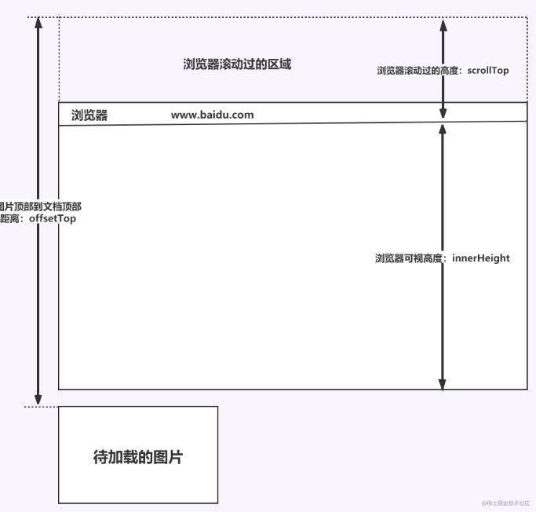

# CSS

## 选择器及优先级

| 选择器     | 格式          | 权重 |
| :--------- | :------------ | ---- |
| id         | #id           | 100  |
| 类         | .class        | 10   |
| 属性选择器 | ref = 'aaa'   | 10   |
| 伪类       | li:last-child | 10   |
| 标签       | p             | 1    |
| 伪元素     | li:after      | 1    |
| 相邻兄弟   | h1+p          | 0    |
| 子选择器   | ul>li         | 0    |
| 后代       | li a          | 0    |
| 通配符     | \*            | 0    |

ps:
继承得到的样式的优先级最低；
样式表的来源不同时，优先级顺序为：内联样式 > 内部样式 > 外部样式 > 浏览器用户自定义样式 > 浏览器默认样式。

## 隐藏元素的方法

- display：none 渲染树不会渲染，该元素不会占据页面位置，监听事件不响应
- visibility：hidden 元素任占据空间，不响应绑定的监听事件
- opacity：0 将元素透明值设置为0，任占据空间，能相应监听事件
- z-index：负值 使用其他元素盖住该元素
- transform：scale（0,0）将元素缩放为0，占据位置但不响应事件

## link与@important区别

## transform

```css
transform:rotate() //旋转
transform:scale() //缩放
transform；skew() //倾斜
transform:translate() //移动
```

## translation（过渡）  and animation

前者实现需要一个触发事件，后执行动画
后者实现不需要触发事件，设定好事件后可以自动执行

## 伪元素 伪类

伪元素：在内容元素前后插入额外的元素或样式，只在外部可见，不会在源代码中找到
`p::before{content:''}`
伪类：将特殊效果添加到特定选择器上，不会产生新的元素
`a:hover {color:#fff}`

## 	requestAnimationframe

要求浏览器在下次重绘之前调用指定回调函数更新动画
属于宏任务

```js
function render(){}
(function animloop(){
	render()
	window.requestAnimationframe(animloop())
})()
```

优点：
1.cpu节能，在页面隐藏或者最小化时，setInterval仍在后台执行任务，而requestAnimationframe会暂停
2.函数节流：保证在每个刷新间隔内仅执行一次函数
3.减少DOM操作：会把每一帧中所有DOM操作集中起来，在一次重绘或回流中完成
setTimeOut缺点：
1.被放入异步队列，实际执行时间比设定时间要晚
2.固定的时间间隔不一定和屏幕刷新时间相同，会引起丢帧

## 盒模型

`box-sizeing: content-box` 标准盒模型
width，height仅包含content

`box-sizeing: border-box` IE盒模型
width，height包含border，padding，content


## li 与 li之间有空白间隔

浏览器会把inline内联元素的空白字符渲染成一个空格
解决：
1.li设置浮动左
2.将所有li写在同一行
3.将ul内字符尺寸设置为零 font-size：0

## css3新特性

圆角 （border-radius:8px）text-shadow 旋转 （transform）

## 常用图片格式

1. BMP 无损 支持索引色 直接色的点阵图
2. GIF 无损 支持索引色的点阵图
3. JPEG 有损 支持直接色的点阵图
4. PNG-8 无损 支持直接色的点阵图
5. PNG-24 无损 支持索引色的点阵图
6. SVG 无损 矢量图

## CSSSprite(精灵图)

将页面中的所有图片都包含到一张大图里去，利用css进行定位
优点：
可有效减少HTTp请求，可以减少图片的字节数
缺点：
开发时困难，需要借助ps对每个背景单元测量其准确位置
维护困难

## line-height

若标签未定义height属性，高度将有line-height决定
赋值方式：固定值/纯数字（会将该比例传给子元素，1.5*18px）/百分比（将计算后的值传给后代）

## css优化 性能提高

加载性能：

1. css压缩
2. 减少使用@import 使用link 后者在页面加载时一块加载
   渲染性能：
   1.减少使用浮动 定位
   2.减少重排 重绘

## 单行 多行文本隐藏

```css
//单行
overflow: hidden;            // 溢出隐藏
text-overflow: ellipsis;      // 溢出用省略号显示
white-space: nowrap;         // 规定段落中的文本不进行换行
//多行
overflow: hidden;            // 溢出隐藏
text-overflow: ellipsis;     // 溢出用省略号显示
display:-webkit-box;         // 作为弹性伸缩盒子模型显示。
-webkit-box-orient:vertical; // 设置伸缩盒子的子元素排列方式：从上到下垂直排列
-webkit-line-clamp:3;        // 显示的行数
```

## 如何判断元素到达可视区域

window.innerHeight 是浏览器可视区的高度；
document.body.scrollTop || document.documentElement.scrollTop 是浏览器滚动的过的距离；
imgs.offsetTop 是元素顶部距离文档顶部的高度（包括滚动条的距离）；
内容达到显示区域的：img.offsetTop < window.innerHeight + document.body.scrollTop;

## z-index属性在什么情况下会失效

父元素position为relative时，子元素的z-index失效
元素没有设置position属性为非static属性。解决：设置该元素的position属性为relative，absolute或是fixed中的一种；
元素在设置z-index的同时还设置了float浮动。解决：float去除，改为display：inline-block；

# 布局

## 两列布局

```css
// 1浮动
.outer {
  height: 100px;
}
.left {
  float: left;
  width: 200px;
  background: tomato;
}
.right {
  margin-left: 200px;
  width: auto;
  background: gold;
}
// 2浮动+BFC
.left{
     width: 100px;
     height: 200px;
     background: red;
     float: left;
 }
 .right{
     height: 300px;
     background: blue;
     overflow: hidden; // 右边触发BFC,避免与左侧浮动元素重叠
 }
 // 3 flex
 .outer {
  display: flex;
  height: 100px;
}
.left {
  width: 200px;
  background: tomato;
}
.right {
  flex: 1;
  background: gold;
}
// 4定位
.outer {
  position: relative;
  height: 100px;
}
.left {
  position: absolute;
  width: 200px;
  height: 100px;
  background: tomato;
}
.right {
  margin-left: 200px;
  background: gold;
}

```