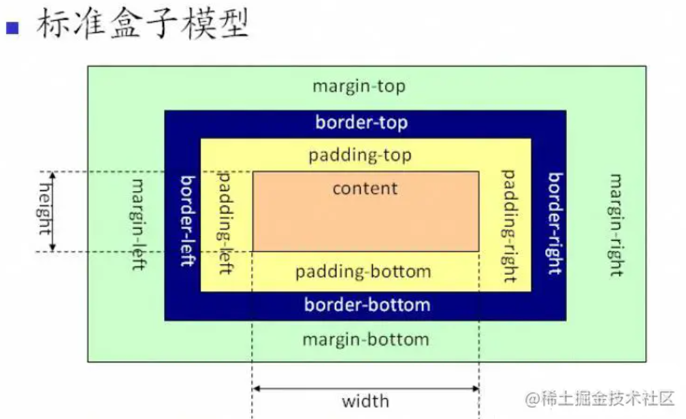
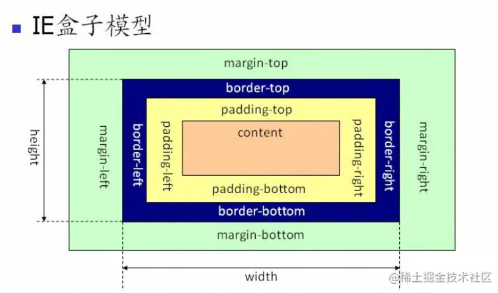

# css

## 1-1 选择器及其优先级

#id	.class	:link	div	兄弟h1+p	子ul>li	后代li a	通配符 *

内联样式>内部样式>外部样式

权重：内联1000	id100	类伪类属性10	标签伪元素1

## 1-2 display属性值及其使用

none：不显示，从文档流中删除

inline：默认宽度为内容宽度，不可设置宽高，同行显示，可设置水平方向的margin和padding属性

block：默认宽度为父元素宽度，换行显示

inline-block：默认宽度为内容宽度，可设置宽高，同行显示

## 1-3 	隐藏元素的方法

display：none

渲染树不会渲染该对象，不会在页面中占据位置，不会响应监听事件，**不可继承**

visibility：hidden

在页面中占据空间，但不会响应事件 **可继承**

opacity：0

将元素透明度设置为0，占据空间且可以响应事件

z-index：负值

用其他元素遮挡该元素

transform：scale（0,0）

缩放为0，占据位置，但不响应事件

## 1-4 盒模型的理解

box-sizeing：content-box 标准盒模型

width和height范围只包含content

box-sizeing：border-box 怪异盒模型

width和height范围包含border margin padding



## 1-4 CSS3中有哪些特性

圆角：border-radius：8px

旋转，倾斜，位移，缩放：transform

文字特效：text-shadow

## 1-5 单行 多行文本溢出

```css
//单行溢出
overflow:hidden;	//溢出隐藏
text-overflow:ellipsis //文本溢出用省略号表示
white-space:nowrap //规定文本不进行换行

//多行溢出
overflow:hidden
text-overflow:ellipsis
display:-webkit-box //作为弹性伸缩盒子的模型表示
-webkit-box-orient:vertical //伸缩盒子的子元素排列方式，从上到下垂直排列
-webkit-line-clamp;3 //显示的行数
```
## 1-6 两列布局

flex布局，左浮动右calc，左浮动右margin-left，左浮动右overflow(BFC的区域不会与float box重叠)

```html
<div class="container clearfix">
  <div class="left">定宽</div>
  <div class="right">自适应</div>
</div>
```
```css
body{
	margin:0
}
.container{
	height:400px
	background:#eebefa
}
.left{
	display:float //flex
	height:400px
	width:200px
	background-color:#f783ac
}
.right{
	width:calc(100% - 200px) // margin-left:200px // overflow:hidden
	//flex；1
	height:400px
	background-color；#c0b75
}
.clearfix:after{
	content:''
	display:block
	clear:both
}
···

```

## 1-7 三列布局

1.绝对定位，左右两栏绝对定位，中间设置margin

2.flex，左右固定大小，中间flex:1

3.浮动，左右固定大小设置浮动，中间设置margin(middle必须放在左右div后面，否则右边的div会掉下)

4.圣杯布局，父元素设置左右的padding，三列均设置浮动，middle设置为父元素宽度，并放在最前面。左右两个div被挤到下一行，两者使用margin负值将自身移到上一行，并使用相对定位，移动到两侧
```css
.outer {
  height: 100px;
  padding-left: 100px;
  padding-right: 200px;
}

.left {
  position: relative;
  left: -100px;

  float: left;
  margin-left: -100%;

  width: 100px;
  height: 100px;
  background: tomato;
}

.right {
  position: relative;
  left: 200px;

  float: right;
  margin-left: -200px;

  width: 200px;
  height: 100px;
  background: gold;
}

.center {
  float: left;

  width: 100%;
  height: 100px;
  background: lightgreen;
}
```
5.双飞翼布局，在middle外嵌套wrapper(设置浮动)，middle设置margin，两侧利用负边距提到上一层
```css
.outer {
  height: 100px;
}

.left {
  float: left;
  margin-left: -100%;

  width: 100px;
  height: 100px;
  background: tomato;
}

.right {
  float: left;
  margin-left: -200px;

  width: 200px;
  height: 100px;
  background: gold;
}

.wrapper {
  float: left;

  width: 100%;
  height: 100px;
  background: lightgreen;
}

.center {
  margin-left: 100px;
  margin-right: 200px;
  height: 100px;
}
```

## 1-8 水平垂直居中

1.利用绝对定位，将元素左上角通过top50，left50定位到页面中心，后通过transform调整元素中心点到页面中心

```css
.parent {    
	position: relative;
		} 
.child {    
	position: absolute;    
	left: 50%;    
	top: 50%;    
	transform: translate(-50%,-50%);
		}
```
2.利用绝对定位，设置四个方向都为0，将margin设为auto
```css
.parent {
    position: relative;
}
.child {
    position: absolute;
    top: 0;
    bottom: 0;
    left: 0;
    right: 0;
    margin: auto;
}
```

3.利用flex布局
```css
.parent {
    display: flex;
    justify-content:center;
    align-items:center;
}
```

## 1-8 如何清除浮动 清除浮动的方式

```css
,clear::after{
content:'';
display:block;
clear:both;
}
```
clear,元素盒子的边不能和`前面`浮动元素相邻
## 1-9 BFC的理解，如何创建BFC
块级格式上下文，独立容器，内部元素和外部互不干扰
1.创建条件：
元素设置浮动：float，设置绝对定位：absolute，fixed，设置overflow：hidden，scroll，auto
display：inline-block，flex
2.特点

- 垂直方向上自上而下，和标准文档流一样
- BFC中上下相邻的两个容器的margin会重叠
- BFC计算高度时，需要计算浮动元素的高度
- BFC区域不会和浮动的容器发生重叠
- BFC内部元素不会影响到外面
- 每个元素的左margin值和容器的左border相邻

## 1-10 position的属性有哪些，区别是什么

1.absolute，绝对定位，相对于第一个不为static的父元素

2.relative，相对定位

3.fixed，绝对定位，相对于屏幕视口

## 1-11 实现一个三角形

div的width，height设为0，border设置宽度，设置各个边颜色

## 1-12 如何解决1px问题

在retina屏幕上，1px会变粗，css的像素不能和移动设备上的相等

window.devicePixelRatio = 设备物理像素/css像素

```css
#container[data-device="2"] {
  border:0.5px solid #333
}
```


## 2-1 常见可继承与不可继承属性

可继承：

字体属性：font-size，font-weight，font-family

文本属性：text-align，line-height，color

不可继承：

盒子模型属性：width，height，margin，border，padding

背景属性：background

定位属性：float，clear，position，overflow

## 2-2 link 和@import的区别

link页面载入入时同时加载，支持js控制dom，还可定义RSS事务

@import在完全载入后加载，不支持改变样式

## 2-3 伪元素和伪类的区别和作用

伪元素：在内容元素前后插入额外的元素或样式

伪类：在已有元素上添加样式

## 2-4 常见图片格式和使用场景

BMP 无损 索引色，直接色 点阵图

GIF 无损 索引色，点阵图

JPEG 有损 直接色 点阵图

svg 矢量图，webp，有损无损直接色点阵图

## 2-5 对精灵图的理解

将页面的所有图片包含到一张大图上，利用css进行背景定位

优点：减少http请求，减少图片的字节

缺点：背景有改动时，需要修改图片

## 2-6 css预处理器的理解

结构清晰，便于拓展

方便的屏蔽浏览器私有语法的差异

## 2-7 对line-height的理解

一行文本的高度，若不定义height，高度由line-height决定

纯数字，将比例传给后代，后代字体为18px，比例1.5，子元素行高为27px

%，将计算后的值传给后代

## 2-8 对媒体查询的理解

@media，针对不同的媒体，定义不同的样式

## 2-9 常见css布局单位

px 像素 //适配少部分设备

% 子元素相对于父元素

em 相对于当前对象的文本字体尺寸

rem 相对于根元素的font-size // 适配多种设备

vw，vh相对于视口的宽高

## 2-10 什么是margin重叠问题，如何解决

两个块级元素的上边距和下边距折叠为一个外边距，大小会取外边距大的那个

兄弟之间重叠：

底部盒子设置为行内块

底部元素设置浮动

父子之间重叠：

父元素加入 overflow：hidden

父元素加透明边框 border：1px solid transport

子元素变为行内块

子元素设置浮动或定位

## 2-11 display，float，position的关系

display：none 》》 position：absolute/fixed 》》float

## 2-12 实现一个扇形

实现一个三角形，然后设置圆角

## 2-13画一条0.5px的线

transform: scale(0.5,0.5);

## 2-14 设置小于12px的字体

-webkit-transform:scale(0.5); 

缩放整个元素，行内元素需要转为行内块或者块级