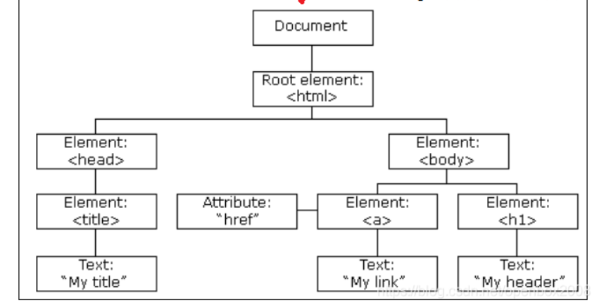
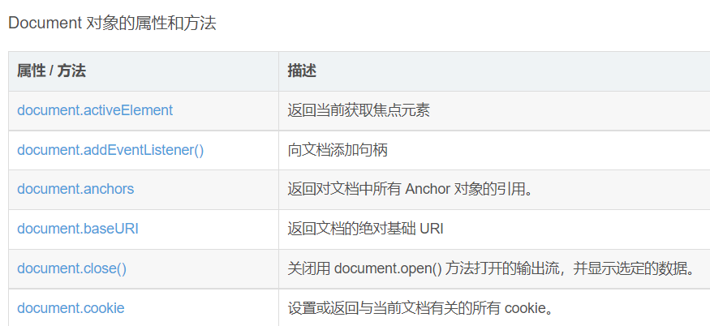
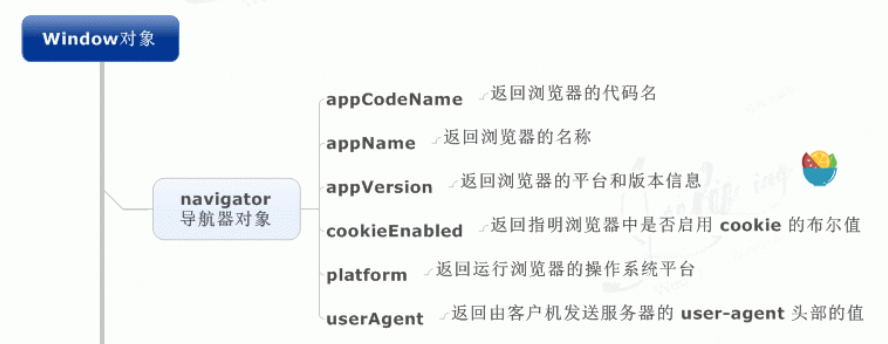
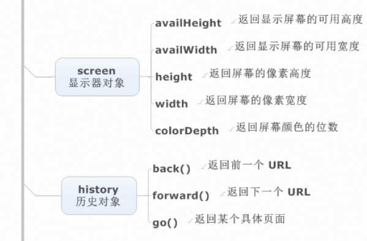
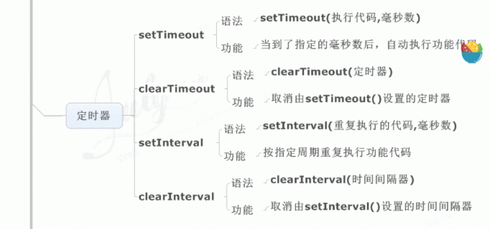

## 1-1 js的数据类型有哪些，区别

number，string，boolean，object，undefined，null，symbol，bigint

symbol 代表创建后独一无二的数据类型，解决全局变量冲突问题

bigint可以表示任意精度格式的整数

原始数据类型：undefined，null，boolean，number，string

引用数据类型：对象，数组，函数

前者，存储在栈中，频繁使用

后者，存储在堆中，占据空间大，大小不固定，栈中存储该对象指针，指针指向堆的实体地址

## 1-2 数据类型检测方式

typeof，对象，数组，null会被判断成object，其余类型判断正确

instanceof，判断原型链上是否能找到该类型的原型

```js
console.log(2 instanceof Number);                    // false
console.log(new Number(2) instanceof Number); //true
```

constructor, 判断对象的构造函数

```js
console.log((2).constructor === Number); // true		
```

## 1-3 判断数组的方式

```js
object.__proto__ == Array.prototype
Array.isArray(obj)
obj instacneof Array
```

## 1-4 null 和undefined区别

undefined 未定义，null空值

typeof null //object

## 1-5 instanceof实现原理和实现

```js
function myinstanceof(left, right){
	let proto = Object.getPrototypeof(left);
    let prototype = right.prototype;
    while(true){
        if(!proto) return false;
        if(proto == prototype) return true;
        proto = Object.getPrototype(proto);
    }
}
```

## 1-6 为什么0.1 + 0.2 != 0.3 

(n1 + n2).toFixed(2)//保留几位小数

js机器精度 Number.EPSILON

```js
function numberepsilon(arg1,arg2){                   
  return Math.abs(arg1 - arg2) < Number.EPSILON;        
}        

console.log(numberepsilon(0.1 + 0.2, 0.3)); // true
```


## 1-7 ==操作符的强制类型转换规则

1、首先会判断两者类型是否相同，相同的话就比较两者的大小
2、类型不相同的话，就会进行[类型转换](https://so.csdn.net/so/search?q=类型转换&spm=1001.2101.3001.7020)
3、会先判断是否在对比 null 和 undefined ，是的话就返回true
4、判断两者类型是否为 string 和 number，是的话就会将[字符串](https://so.csdn.net/so/search?q=字符串&spm=1001.2101.3001.7020)转换为number
5、判断其中一方是否为[boolean](https://so.csdn.net/so/search?q=boolean&spm=1001.2101.3001.7020),是的话就会把 boolean 转为 number 再进行判断
6、判断其中一方是否为object 且另一方为 string、number、或者symbol，是的话就会把 object 转为原始类型再进行判断

## 1-8 Object.is()和比较运算符的区别

- 使用双等号（==）进行相等判断时，如果两边的类型不一致，则会进行强制类型转化后再进行比较。

- 使用三等号（===）进行相等判断时，如果两边的类型不一致时，不会做强制类型准换，直接返回 false。

- 使用 Object.is 来进行相等判断时，一般情况下和三等号的判断相同，它处理了一些特殊的情况，比如 -0 和 +0 不再相等，两个 NaN 是相等的。

  `Object.is(-0,+0) //false`

## 1-9 new操作符的实现原理

```js
function mynew(fn,...arg){
	let obj = {};
	obj.__proto__ == fn.prototype;
	let res = fn.apply(obj,arg);
	return res instanceof Object : res ? obj;
}
new 与 Objectcreate的区别
1.new 只接受 改造函数，后者除构造函数外，还可以接收普通对象
2.后者传入构造函数 不会继承构造函数的属性，前者传入对象会继承对象的属性
3.后者可以实现没有原型的空对象
```

## 1-10 数组常见的原生方法

toString(),toLocalString(),join()

pop(),push(),shifit,unshift()

concat(),slice(),splice(),indexOf(),every(),some()

## 1-11 什么是BOM和DOM

DOM文档对象模型，定义了处理网页内容的方法和接口



BOM，浏览器对象模型，定义了与浏览器进行交互的方法和接口

BOM中的核心对象是 window对象(子对象，document、location、navigator、screen、history、frames)








## 1-12 对类数组对象的理解，如何转为数组

一个拥有length属性和若干索引属性的对象叫做类数组对象，但不能调用数组的方法

```js
//转数组的方法
Array.prototype.slice.call(arraylike)
Array.prototype.concat.apply([], arrayLike);
```

## 1-13 对ajax的理解，实现一个ajax请求

1. 创建XMLHttpRequest对象

2. 在该对象上使用open方法创建一个HTTP请求

3. 调用send发送请求

4. 判断相应数据并进行操作

```js
   let xhr = new XMLHttpRequest();
   xhr.open('get','http://127.0.0.1',true);
   xhr.send()
   xhr.onreadystatechange = function(){
       if(xhr.readystate === 4){
           if(xhr.state === '200' || xhr,state === '304'){
               console.log(xhr.response)
           }
           else{
               console.log(xhr)
           }
       }
   }
   //promise实现
   let ajax = (method,url) => {
       return new Promise((resolve,reject)=>{
           let xhr = new XMLHttpRequest();
           xhr.open(method,url);
           xhr.send();
           xhr.onreadystatechange = function(){
               if(xhr.readystate == 4){
                   if(xhr.state == 200 || xhr.state == 304){
                       resolve(xhr.response);
                   }
                   else{
                       reject(xhr);
                   }
               }
           }
       })
   }
```

   

## 1-14 js为什么要进行变量提升

js引擎在执行代码有解析过程，创建执行上下文

解析阶段，变量声明为undefined，函数声明好可使用

执行阶段，按照代码顺序执行

变量提升原因：

1.提高性能，仅需执行一次语法检查和预编译，避免每次执行代码前都要重新解析变量/函数

2.容错性好，可以先使用后定义变量

缺陷，会对全局变量的输出造成影响

```js
var tmp = new Date();

function fn(){
	console.log(tmp);
	if(false){
		var tmp = 'hello world';
	}
}

fn();  // undefined
```

## 1-15 let const var区别

1. 块级作用域：由{}包括，let const 有块级作用域，解决ES5中的问题，内层变量覆盖外部变量，循环变量泄露为全局变量
2. 变量提升，var存在变量提升
3. 暂时性死区，let const,在声明前均不可使用，存在暂时性死区
4. 重复声明，var重复声明变量，后者可覆盖前者，let const不允许

## 1-16 箭头函数和普通函数的区别

1. 箭头函数没有自己的this，只会在自己作用域上一层继承this
2. 箭头函数的this在定义时确定，且不会改变
3. 箭头函数不能做为构造函数使用，this无法用call改变，没有prototype属性

## 1-17 对原型和原型链的理解

原型包含了可以由该构造函数的所有实例共享的属性和方法


## 1-18 原型链的指向

```js
p.__proto__  // Person.prototype
Person.prototype.__proto__  // Object.prototype
p.__proto__.__proto__ //Object.prototype
p.__proto__.constructor.prototype.__proto__ // Object.prototype
Person.prototype.constructor.prototype.__proto__ // Object.prototype
p1.__proto__.constructor // Person
Person.prototype.constructor  // Person
```

## 1-19 对promise的理解

解决异步编程的一种方案，解决了回调地狱问题

三个状态：pending，resolved，rejected

promise是一个构造函数，接受一个函数作为参数，返回一个promise实例

## 1-20 promise的基本用法

创建promise对象;

```js
const promise = new Promise(function(resolve, reject) {
  // ... some code
  if (/* 异步操作成功 */){
    resolve(value);
  } else {
    reject(error);
  }
});
```

promise方法：

```js
//then()
promise.then(function(value) {
  // success
}, function(error) {
  // failure
});

//catch()
//相当于then的第二个参数，但在执行resolve报错时，会进入catch中，不会停止运行
p.then((data) => {
     console.log('resolved',data);
},(err) => {
     console.log('rejected',err);
     }
); 
p.then((data) => {
    console.log('resolved',data);
}).catch((err) => {
    console.log('rejected',err);
});

//all() 存在一个promise对象状态为rejected则返回rejected 否则返回resolve
let promise1 = new Promise((resolve,reject)=>{
	setTimeout(()=>{
       resolve(1);
	},2000)
});
let promise2 = new Promise((resolve,reject)=>{
	setTimeout(()=>{
       resolve(2);
	},1000)
});
let promise3 = new Promise((resolve,reject)=>{
	setTimeout(()=>{
       resolve(3);
	},3000)
});
Promise.all([promise1,promise2,promise3]).then(res=>{
    console.log(res);
    //结果为：[1,2,3] 
})

//race() 第一个返回的promise是啥就是啥
let promise1 = new Promise((resolve,reject)=>{
	setTimeout(()=>{
       reject(1);
	},2000)
});
let promise2 = new Promise((resolve,reject)=>{
	setTimeout(()=>{
       resolve(2);
	},1000)
});
let promise3 = new Promise((resolve,reject)=>{
	setTimeout(()=>{
       resolve(3);
	},3000)
});
Promise.race([promise1,promise2,promise3]).then(res=>{
	console.log(res);
	//结果：2
},rej=>{
    console.log(rej)};
)

//finally 最后执行的动作
promise
.then(result => {···})
.catch(error => {···})
.finally(() => {···});
```

## 1-21 async和await的理解

async：

async函数返回的是一个promise对象，如果在函数中直接return一个直接量，async会直接将直接量通过promise.resolve()封装成promise对象。无返回值：返回 Promise.resolve(undefined)

await：

如果等待的不是一个promise对象，返回运算结果

如果是promise对象，await阻塞后面的代码(并且暂停async的执行)，等待promise对象resolve

## 1-22 async和await对promise的优势

具有依赖的异步代码会更加清晰

async/await捕获异常

```js
async function fn(){
    try{
        let a = await Promise.reject('error')
    }catch(error){
        console.log(error)
    }
}
```

## 1-23 对闭包的理解

闭包指有权访问另一个作用域中变量的函数

两个用途：

1. 在函数外部可以访问到函数内部的变量

```js
function A() {
  var a = "a";
  return function B() {
    console.log(a);
  }
}
var fun = A();
fun();

```

2. 使运行结束的函数上下文中的变量对象继续留在内存中

```js
function hd1(){
    let n = 1;
    return function sum(){
      console.log(++n);
    }
    sum();
  }
//tem1 指向hd1，js垃圾处理机制不会回收
  let tem1 = hd1();//此时为执行了hd1函数，返回了sum函数给了tem1
  tem1();//2
  tem1();//3
  tem1();//4
//新开辟一个内存空间
  let tem2 = hd1();//此时是新开辟了一个内存空间，n的起始值还是1
  tem2();//2
  tem2();//3
  
  tem1();//5
```

## 1-24 对作用域 作用域链的理解

1. 全局作用域

   - 最外层函数和最外层函数外面定义的变量拥有全局作用域
   - 所有未定义直接赋值的变量自动声明为全局作用域
   - 所有window对象的属性拥有全局作用域
   - 全局作用域有很大的弊端，过多的全局作用域变量会污染全局命名空间，容易引起命名冲突。

2. 函数作用域

   - 函数作用域声明在函数内部的变零，一般只有固定的代码片段可以访问到
   - 作用域是分层的，内层作用域可以访问外层作用域，反之不行

3. 块级作用域

   - 使用ES6中新增的let和const指令可以声明块级作用域，块级作用域可以在函数中创建也可以在一个代码块中的创建（由`{ }`包裹的代码片段）

   - let和const声明的变量不会有变量提升，也不可以重复声明

   - 在循环中比较适合绑定块级作用域，这样就可以把声明的计数器变量限制在循环内部。

4. 作用域链
	在当前作用域中找所需变量，没有则去父级作用域找，直到window对象为止

## 1-25 对执行上下文的理解

在执行一点JS代码之前，需要先解析代码。解析的时候会先创建一个全局执行上下文环境，先把代码中即将执行的变量、函数声明都拿出来，变量先赋值为undefined，函数先声明好可使用。这一步执行完了，才开始正式的执行程序。

在一个函数执行之前，也会创建一个函数执行上下文环境，跟全局执行上下文类似，不过函数执行上下文会多出this、arguments和函数的参数。

## 1-26 对this对象的理解

this 是执行上下文中的一个属性，它指向最后一次调用这个方法的对象。

- 第一种是**函数调用模式**，当一个函数不是一个对象的属性时，直接作为函数来调用时，this 指向全局对象。
- 第二种是**方法调用模式**，如果一个函数作为一个对象的方法来调用时，this 指向这个对象。
- 第三种是**构造器调用模式**，如果一个函数用 new 调用时，函数执行前会新创建一个对象，this 指向这个新创建的对象。
- 第四种是 **apply 、 call 和 bind 调用模式**，这三个方法都可以显示的指定调用函数的 this 指向。其中 apply 方法接收两个参数：一个是 this 绑定的对象，一个是参数数组。call 方法接收的参数，第一个是 this 绑定的对象，后面的其余参数是传入函数执行的参数。也就是说，在使用 call() 方法时，传递给函数的参数必须逐个列举出来。bind 方法通过传入一个对象，返回一个 this 绑定了传入对象的新函数。这个函数的 this 指向除了使用 new 时会被改变，其他情况下都不会改变。
