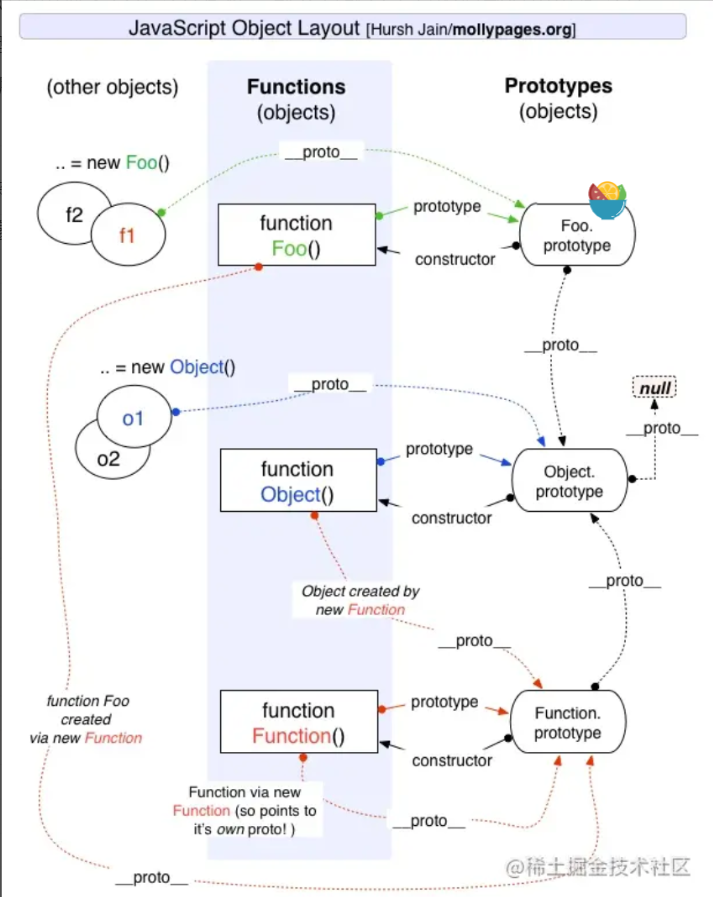

## JS中的原型链

原型包含了可以由该构造函数的所有实例共享的属性和方法



```js
p.__proto__  // Person.prototype
Person.prototype.__proto__  // Object.prototype
p.__proto__.__proto__ //Object.prototype
p.__proto__.constructor.prototype.__proto__ // Object.prototype
Person.prototype.constructor.prototype.__proto__ // Object.prototype
p1.__proto__.constructor // Person
Person.prototype.constructor  // Person
```

## JS中的异步操作


### 对promise的理解

解决异步编程的一种方案，解决了回调地狱问题

三个状态：pending，resolved，rejected

promise是一个构造函数，接受一个函数作为参数，返回一个promise实例

### promise的基本用法

创建promise对象;

```js
const promise = new Promise(function(resolve, reject) {
  // ... some code
  if (/* 异步操作成功 */){
    resolve(value);
  } else {
    reject(error);
  }
});
```

promise方法：

```js
//then()
promise.then(function(value) {
  // success
}, function(error) {
  // failure
});

//catch()
//相当于then的第二个参数，但在执行resolve报错时，会进入catch中，不会停止运行
p.then((data) => {
     console.log('resolved',data);
},(err) => {
     console.log('rejected',err);
     }
); 
p.then((data) => {
    console.log('resolved',data);
}).catch((err) => {
    console.log('rejected',err);
});

//all() 存在一个promise对象状态为rejected则返回rejected 否则返回resolve
let promise1 = new Promise((resolve,reject)=>{
	setTimeout(()=>{
       resolve(1);
	},2000)
});
let promise2 = new Promise((resolve,reject)=>{
	setTimeout(()=>{
       resolve(2);
	},1000)
});
let promise3 = new Promise((resolve,reject)=>{
	setTimeout(()=>{
       resolve(3);
	},3000)
});
Promise.all([promise1,promise2,promise3]).then(res=>{
    console.log(res);
    //结果为：[1,2,3] 
})

//race() 第一个返回的promise是啥就是啥
let promise1 = new Promise((resolve,reject)=>{
	setTimeout(()=>{
       reject(1);
	},2000)
});
let promise2 = new Promise((resolve,reject)=>{
	setTimeout(()=>{
       resolve(2);
	},1000)
});
let promise3 = new Promise((resolve,reject)=>{
	setTimeout(()=>{
       resolve(3);
	},3000)
});
Promise.race([promise1,promise2,promise3]).then(res=>{
	console.log(res);
	//结果：2
},rej=>{
    console.log(rej)};
)

//finally 最后执行的动作
promise
.then(result => {···})
.catch(error => {···})
.finally(() => {···});
```

### async和await的理解

async：

async函数返回的是一个promise对象，如果在函数中直接return一个直接量，async会直接将直接量通过promise.resolve()封装成promise对象。无返回值：返回 Promise.resolve(undefined)

await：

如果等待的不是一个promise对象，返回运算结果

如果是promise对象，await阻塞后面的代码(并且暂停async的执行)，等待promise对象resolve

### async和await对promise的优势

具有依赖的异步代码会更加清晰

async/await捕获异常

```js
async function fn(){
    try{
        let a = await Promise.reject('error')
    }catch(error){
        console.log(error)
    }
}
```

## JS中的闭包

闭包指有权访问另一个作用域中变量的函数

两个用途：

1. 在函数外部可以访问到函数内部的变量

```js
function A() {
  var a = "a";
  return function B() {
    console.log(a);
  }
}
var fun = A();
fun();

```

2. 使运行结束的函数上下文中的变量对象继续留在内存中

```js
function hd1(){
    let n = 1;
    return function sum(){
      console.log(++n);
    }
    sum();
  }
//tem1 指向hd1，js垃圾处理机制不会回收
  let tem1 = hd1();//此时为执行了hd1函数，返回了sum函数给了tem1
  tem1();//2
  tem1();//3
  tem1();//4
//新开辟一个内存空间
  let tem2 = hd1();//此时是新开辟了一个内存空间，n的起始值还是1
  tem2();//2
  tem2();//3
  
  tem1();//5
```
## JS中的this指向
### 对作用域 作用域链的理解

1. 全局作用域

   - 最外层函数和最外层函数外面定义的变量拥有全局作用域
   - 所有未定义直接赋值的变量自动声明为全局作用域
   - 所有window对象的属性拥有全局作用域
   - 全局作用域有很大的弊端，过多的全局作用域变量会污染全局命名空间，容易引起命名冲突。

2. 函数作用域

   - 函数作用域声明在函数内部的变零，一般只有固定的代码片段可以访问到
   - 作用域是分层的，内层作用域可以访问外层作用域，反之不行

3. 块级作用域

   - 使用ES6中新增的let和const指令可以声明块级作用域，块级作用域可以在函数中创建也可以在一个代码块中的创建（由`{ }`包裹的代码片段）

   - let和const声明的变量不会有变量提升，也不可以重复声明

   - 在循环中比较适合绑定块级作用域，这样就可以把声明的计数器变量限制在循环内部。

4. 作用域链
	在当前作用域中找所需变量，没有则去父级作用域找，直到window对象为止

### 对执行上下文的理解

在执行一点JS代码之前，需要先解析代码。解析的时候会先创建一个全局执行上下文环境，先把代码中即将执行的变量、函数声明都拿出来，变量先赋值为undefined，函数先声明好可使用。这一步执行完了，才开始正式的执行程序。

在一个函数执行之前，也会创建一个函数执行上下文环境，跟全局执行上下文类似，不过函数执行上下文会多出this、arguments和函数的参数。

### 对this对象的理解

this 是执行上下文中的一个属性，它指向最后一次调用这个方法的对象。

- 第一种是**函数调用模式**，当一个函数不是一个对象的属性时，直接作为函数来调用时，this 指向全局对象。
- 第二种是**方法调用模式**，如果一个函数作为一个对象的方法来调用时，this 指向这个对象。
- 第三种是**构造器调用模式**，如果一个函数用 new 调用时，函数执行前会新创建一个对象，this 指向这个新创建的对象。
- 第四种是 **apply 、 call 和 bind 调用模式**，这三个方法都可以显示的指定调用函数的 this 指向。其中 apply 方法接收两个参数：一个是 this 绑定的对象，一个是参数数组。call 方法接收的参数，第一个是 this 绑定的对象，后面的其余参数是传入函数执行的参数。也就是说，在使用 call() 方法时，传递给函数的参数必须逐个列举出来。bind 方法通过传入一个对象，返回一个 this 绑定了传入对象的新函数。这个函数的 this 指向除了使用 new 时会被改变，其他情况下都不会改变。

###  call和apply的区别

作用一模一样，区别仅在于传入参数的形式的不同。

### 实现call apply bind

## JS中的内存泄露

## JS中的Event Loop(事件循环)

## JS中的数组扁平化

## JS中的数组遍历方法

## JS中的深拷贝和浅拷贝

## 番外：CommonJS和ES6 module

## 番外：Ajax请求和fetch请求

